# GIT UNTUK KOLABORASI

## FROK
Fork adalah membuat clone dari suatu repo di GitHub milik upstream author, diletakkan ke milik kontributor. Fork hanya dilakukan sekali saja. Pada dasarnya, proses untuk fork ini meliputi:

1. Fork repo di web GitHub.
2. Clone fork tersebut di komputer lokal.

Kontributor harus mem-fork repo upstream author sehingga di repo kontributor muncul repo tersebut. Proses forking ini dijelaskan dengan langkah-langkah berikut:

1. Login ke GitHub
2. Akses repo yang akan di-fork
3. Pada sisi kanan atas, klik Fork:

4. Pilih akan ditempatkan di account mana.
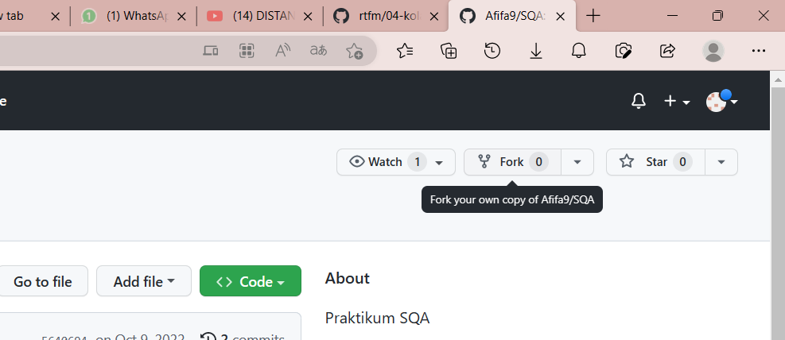

5. Setelah proses, repo dari upstream author sudah berada di account GitHub kita (kontributor)
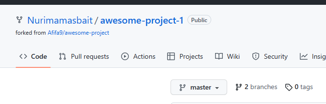

Setelah proses tersebut, clone di komputer lokal:
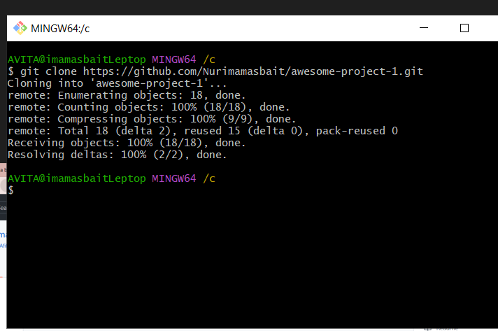

Repo origin sudah dituliskan konfigurasinya pada saat melakukan proses clone dari repo kontributor. Konfigurasi repo upstream harus dibuat.
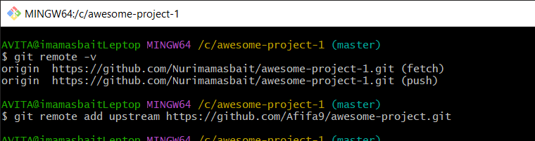

Tambahkan remote upstream:
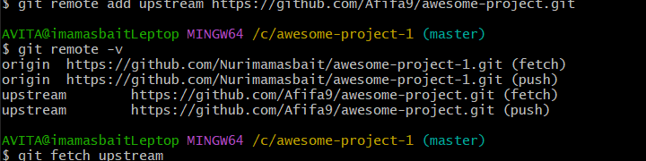

Hasil :
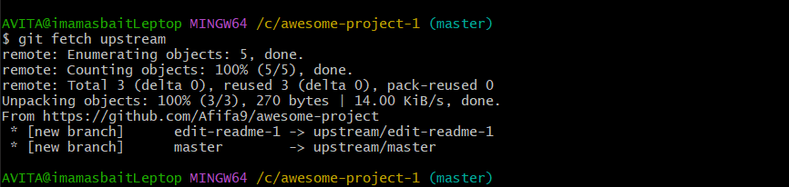

# Mengirim Pull Request
Langkah - langkahnya
1. Kontributor akan bekerja di repo lokal (create, update, delete isi)
2. Commit
3. Push ke repo kontributor
4. Kirimkan PR ke repo upstream author.
5. Upstream author me-review dan kemudian menyetujui (merge) ke master atau menolak PR.
6. Jika disetujui dan di-merge ke repo master dari upstream author, sinkronkan repo di komputer lokal dan repo GitHub kontributor.

# Membuat Perubahan di Repo Lokal

1. Sudah ada koordinasi secara manual tentang perubahan-perubahan yang akan dilakukan.
2. Setelah melakukan perubahan-perubahan, pastikan bahwa isi repo lokal tersinkronisasi dengan repo dari upstream author.
3. Cara melakukan sinkronisasi:

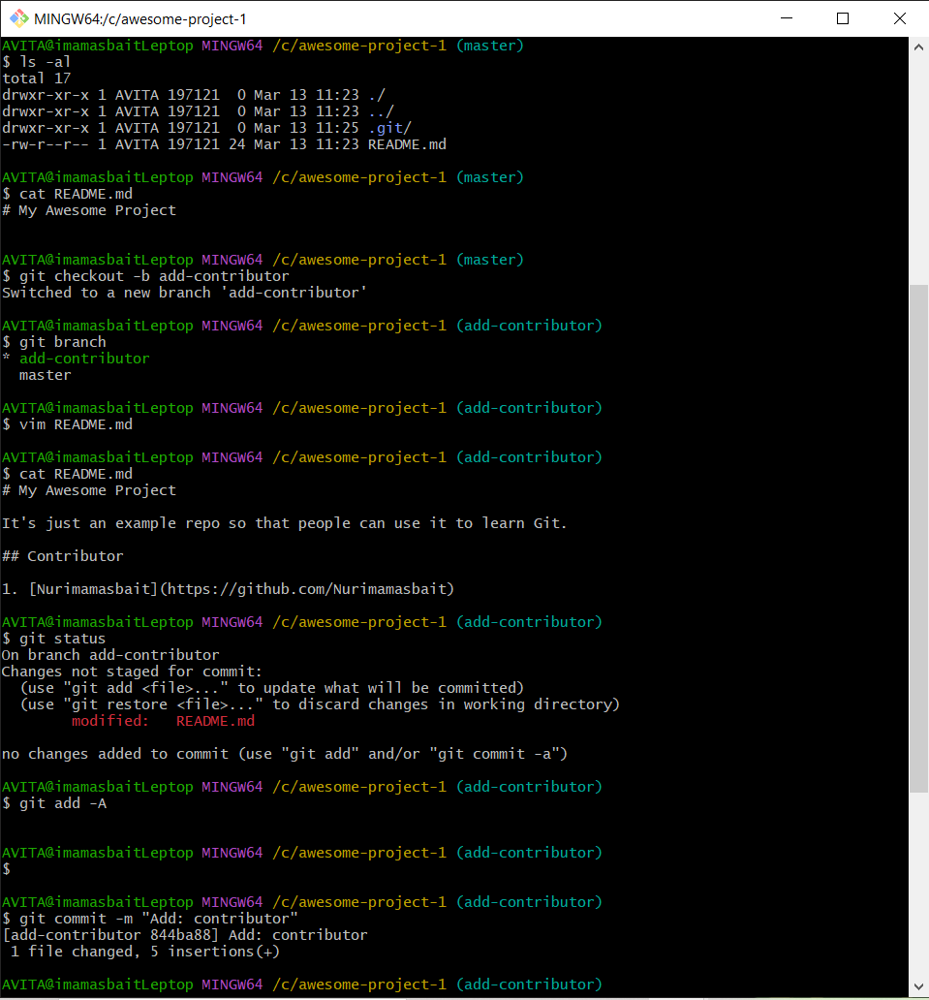

4. Lakukan perubahan-perubahan, setelah itu push ke origin (milik kontributor)
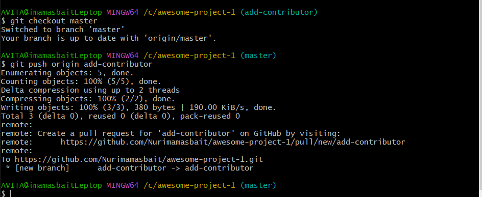

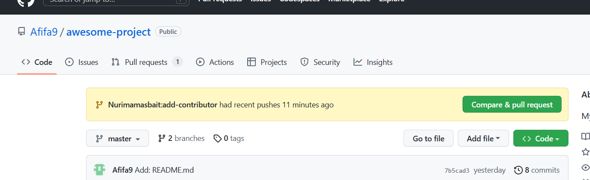

5. Setelah itu, buka halaman Web dari repo kontributor . Pada halaman tersebut akan ditampilkan isi yang kita push.
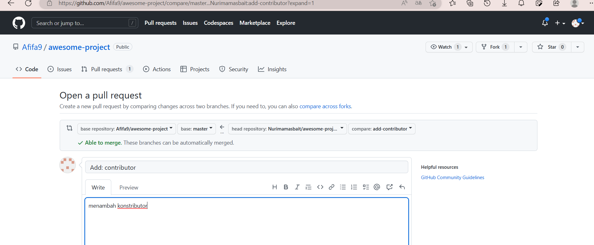

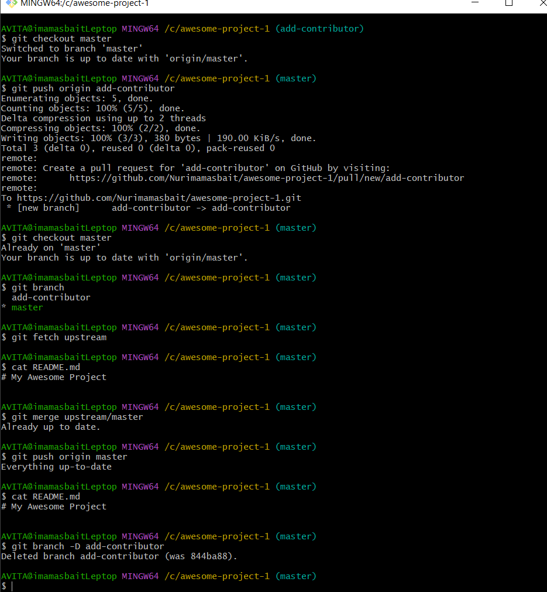

