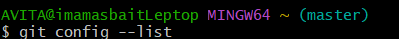
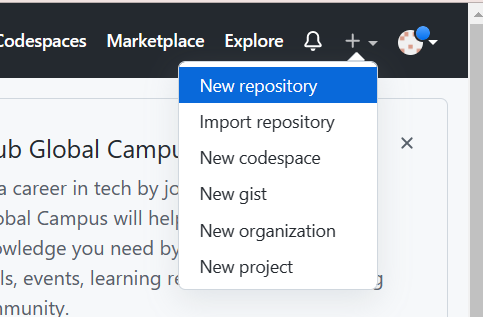

## INSTALASI GIT DI WINDOWS

1. Setelah download git , selanjutnya klik file yang telah didownload. Maka akan menampilkan seperti gambar ini , Klik next untuk lanjut

2. Selanjutnya pilih lokasi instal , akan tetapi lokasi instal akan ditampilkan secara langsung oleh karena itu biarkan saja dan klik Next

3. Selanjutnya pilih komponen , biarkan saja seperti itu dan klik next

4. Selanjutnya bagian menu select Components anda biarkan saja default kemudian klik Next

5. Selanjutnya pengaturan PATH Enviroment . Pilih yang tengah agar perintah git dapat dikenali di command 

6. Selanjutnya konversi line ending . Biarkan saja seperti ini , lanjut klik Next

7. Selanjutnya pilihlah emulator terminal. Pilih bagian kedua , lanjut klik next

8. Selanjutnya pilihlah opsi ekstra. Klik next untuk lanjut

9. Selanjutnya klik instal untuk memulai proses peninstalan

10. Tunggu proses install selesai

11. Setelah instal selesai klik finish

12. Seleasi maka anda dapat menggunakan git . Untuk menjalankan klik start menu , ketik "Git" selanjutnya akan ditampilkan pilihan "Git Bash" atau "Got GUI"

13. Tampilan jika anda menggunakan " Git Bash"

14. Tampilan jika anda menggunakan "Git GUI"

15. Untuk menggunakan CMD selanjutnya masukan perintah "git --version" untuk melihat apakah sudah terinstal atau belum jika sudah tampilan seperti ini

## Konfigurasi Git

Pada konfigurasi git dapat anda gunakan perintah git config. Salah satu hal pertama yang harus dilakukan adalah menyiapkan nama dan alamat email anda

Dari hasil konfigurasi git akan menampilkan hasil ini

Pada konfigurasi git hanya dilakukan satu kali saja, tetapi jika ingin dilulakan kembali jika melakukan perubahan nama dan email

### Mengelola Repo Sendiri di Account Sendiri

Dalam melakukan Repo anda harus suda mempunyai akun di Github .Selanjutnya langkah - langkahnya sebagai berikut :

# Membuat repo
Untuk membuat repo gunakan langkah berikut

1. Pertama klik tanda + pada bagian atas kanan setelah itu pilih New repository

2. Selanjutnya isikan nama repo,keterangan, serta lisensi sesui keinginan anda

3. Selanjutnya klik Create repository

Setelah selesai repo akan dibuat dan dapat diakses. 

## Clon Repo

# Mengelola Repo 
Setelah clone ke komputer local, semua manipulasi konten dilakukan di komputer lokal dan hasilnya akan dipush ke remote repo di Github. Maka dari itu jangan berganti - ganti remote local sekali dibuat disitu tetap disitu. Jika kehilangan repo lokal, clone ulang ke diktori yang bersih dan kosong setelah itu baru melakukan pengelolaan repo. Selanjutnya berikut hal yang dapat dilakukan.

# Mengubah Isi-Push Tanpa Bracnhing dan Mergin

Perubahan isi bisa terjadi karena satu atau kombinasi beberapa hal berikut:
  1. File dihapus
  2. File diedit
  3. Membuat file / direktori baru
  4. Menghapus direktori

Berikut melakukan perubahan di komputer lokal , setelah itu push ke repo

Cara ini lebih mudah tetapi mempunyai resiko jika terjadi kesalahan dalam edit. Cara yang lebih aman tetapi memerlukan langkah yang lebih panjang adalah branching and merging

## Mengubah Isi dengan Branching and Merging

Pada bagian ini setiap kali melakukan perubahan di lokal komputer dengan membuat suatu cabang yang nantinya digunakan untuk menampung perubahan - perubahan. Setelah itu cabang akan di kirim ke repo Github untuk dimintai riview kemudian digabungkan (''' merge ''') ke main. Secara umum repo yang dibuat sudah akan mempunyai satu branc yang disebut ''' main ''' atau ''' master '''.

