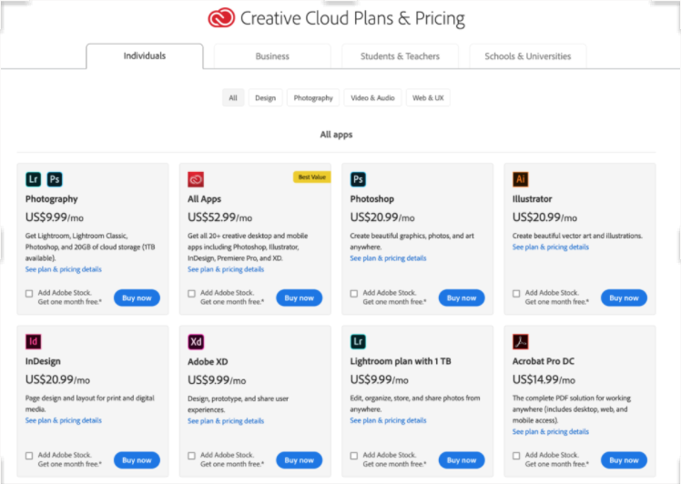

# Layanan Saas

## 1. Adobe Crative Cloud (Adobe CC)
### Apa itu Adobe Crative Cloud
Layanan ini merupakan produk Adobe yang menawarkan solusi terbaik untuk desain grafis, desain web, serta pengeditan foto dan video secara online. Adobe CC mempermudahkan kerja para desainer berkat penyimpanannya yang berbasis cloud.
Pada September 2003 silam, Adobe melahirkan sistem aplikasi Creative Suite (CS). Sistem yang satu ini berisi aplikasi-aplikasi kreatif, misalnya:
- Adobe Photoshop
- Adobe Illustrator
- Adobe InDesign
- dan lain-lain

### Penawaran tambahan dari Adobe Creative Cloud itu adalah akses ke:
- Adobe Fonts
- Behance
- Adobe Portfolio
- ruang penyimpanan cloud sebesar 100GB
- dan lain-lain

### Apa yang Dilakukan Creative Cloud
Adobe Creative Cloud adalah alat untuk memungkinkan kreativitas dan kolaborasi. Dalam hal pengembangan web, misalnya, Creative Cloud mencakup hampir semua hal yang dibutuhkan seseorang untuk membangun situs web yang berfungsi penuh dari bawah ke atas, terlepas dari apakah mereka memiliki kemampuan untuk membuat kode. Creative Cloud menyediakan aplikasi untuk mengerjakan proyek termasuk pengeditan video, desain seluler, dan bahkan penerbitan desktop. Dokumen dan proyek Creative Cloud juga dapat disimpan di cloud, file-file tersebut tidak hanya tersedia di perangkat apa pun yang mungkin dimiliki pengguna yang memiliki koneksi Internet aktif tetapi juga dapat dibagikan dengan orang lain.

### harga aplikasi Adobe Creative Cloud satuan itu adalah:

- Adobe Photoshop, 20,99 dolar AS per bulan
- Adobe Illustrator, 20,99 dolar AS per bulan
- Adobe InDesign, 20,99 dolar AS per bulan
- Adobe XD, 9,99 dolar AS per bulan
- Adobe Premiere Pro, 20,99 dolar AS per bulan
- Adobe Premiere Rush, 9,99 dolar AS per bulan
- dan lain-lain

### Keuntungan Menggunakan Adobe Creative Cloud
- Mudah dalam instalasi dan upgrade versi terbaru
- Bujet lebih terjangkau
- Memiliki fitur revoke lisensi

### Versi non cloud dengan fungsional yang sama adalah 
Scribus adalah aplikasi desain grafis yang dapat digunakan untuk desain layout majalah , koran , buku, dll. 

## 2. Lumen5 
### Apa Itu Lumen5
Lumen5 adalah sebuah platfrom pembuatan vidieo untuk konten yang diposting dimedia sosial.Lumen5 memiliki tujuan untuk memungkinkan siapa pun untuk membuat video dengan mudah dan hanya dalam hitungan menit.Meskipun tidak memiliki bekal dalam hal editing video, kamu tidak perlu khawatir. Pasalnya, tools ini memiliki teknologi yang akan membantu penggunanya saat membuat video.Menariknya, tidak hanya untuk membuat video, Lumen5 juga menyediakan sumber daya yang dibutuhkan untuk membuat video lebih menarik.

### Fitur Unggul yang ditawarkan
1. Text to Video
Fitur unggulan pertama dari Lumen5 adalah Text to Video yang mampu membantu pengguna untuk mengubah artikel menjadi konten video.
2.  Automated Workflow
Fitur yang satu ini diklaim dapat membuat video dalam hitungan menit, karena menggunakan Artificial Intelligence atau kecerdasan buatan. Dengan fitur ini pengguna akan dibantu dengan kecerdasan buatan untuk membagi durasi setiap adegan berdasarkan jumlah teks artikel yang digunakan.Penempatan teks dalam video juga akan diatur secara otomatis agar bisa lebih enak dibaca oleh audiens.Cara menggunakan fitur ini juga terbilang sangat mudah. Kamu hanya perlu memasukkan link artikel dan tools ini akan secara otomatis akan mengambil konten dan membuat storyboard.
3. Media Library
Fitur unggulan selanjutnya dari Lumen5 adalah media library yang dimilikinya. Di sini terdapat jutaan gambar dan musik yang bisa digunakan untuk videomu.
4. Branding Options
Semua video yang kamu buat dengan Lumen5 bisa disesuaikan dengan tampilan yang dimiliki oleh brand.Hal itu bisa dilakukan dengan memilih palet warna yang sudah disediakan
5. Format Video
Kelebihan dari Lumen5 yang selanjutnya adalah tersedianya format video yang beragam.
Mulai dari resolusi video yang ditawarkan yaitu 480p, 720p, hingga 1080p. Selain itu, untuk aspect ratio juga bisa dengan mudah dipilih apakah itu dengan format standar 16:9, format square 1:1, atau format vertikal 9:16 yang khusus digunakan untuk Instagram.

### Harga Lumen5
Lumen dapat digunakan secara gratis oleh siapapun. Namun ada beberapa fitur tertentu yang tidak tersedia secara gratis .
Berikut ini beberapa paket yang ditawarkan oleh Lumen5 dianataranya

#### Community
- Gratis selamanya
- Bisa edit 3 video setiap bulannya
- Terdapat watermark dari Lumen5
- Resolusi video yang disediakan hanya 720p
#### Creator
- Seharga 11 dollar AS atau sekitar 156 ribu rupiah per bulannya
- Bisa edit sebanyak 10 video setiap bulannya
- Tidak terdapat watermark Lumen5
#### Premium
- Seharga 59 dollar AS atau sekitar 841 ribu rupiah per bulannya
- Bisa digunakan untuk mengedit 15 video setiap bulannya
- Mendapatkan akses 15 juta stok foto dan video
- Kemudahan kustomisasi warna dan style video
- Resolusi video yang disediakan hingga 1080p
#### Business
- Seharga 149 dollar AS atau sekitar 2,1 juta rupiah per bulannya
- Mampu untuk edit 20 video setiap bulannya
- Akses ke 200 juta stok foto dan video
- Bisa menggunakan watermark dan font milik sendiri

### Manfaat Lumen5
- Dengan Lumen5 Anda dapat dengan mudah mengubah artikel dan posting blog menjadi konten video.
- Lumen5 membuat video dalam hitungan menit dengan bantuan AI.
- Anda juga dapat menyalin & menempelkan konten offline ke Lumen5 untuk mulai membuat video.
- Fitur pemosisian teks dihitung secara cerdas berdasarkan komposisi file media yang Anda pilih.
- Cukup colokkan umpan RSS untuk pendekatan yang lebih otomatis dan Anda memiliki template video yang dibuat secara otomatis setiap hari.
- Dengan fitur ini Anda dapat dengan mudah memasukkan tautan ke posting blog atau artikel dan secara otomatis akan mengambil konten dan mengisi skrip Anda.

### Versi non cloud dengan fungsional yang sama adalah 
- DaVinci Resolve adalah sebuah aplikasi edit video gratis yang tersedia untuk sistem operasi Windows, MacOS, dan Linux. Meskipun software ini dapat digunakan secara gratis, tetapi DaVinci menawarkan fitur yang cukup lengkap.
- VideoPad
VideoPad adalah aplikasi video editor yang tersedia untuk Windows dan MacOS, dengan fitur yang lebih lengkap tersedia untuk versi Windows.Kamu dapat mengunduh dan menggunakan VideoPad untuk tujuan non-komersil secara gratis, tetapi kamu akan mendapatkan beberapa notifikasi yang cukup mengganggu.

