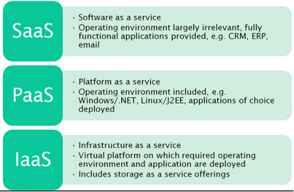

# RANGKUMAN

## A. Apa itu Iaas, SaaS. dan Paas
- IaaS (Infrastructure as a Service) — infrastruktur komputasi (server, penyimpanan data, jaringan, sistem operasi), yang disediakan bagi pelanggan untuk menyebarkan dan menjalankan solusi perangkat lunak mereka;
- SaaS (Software as a Service) — aplikasi berbasis cloud yang dapat diakses pengguna akhir melalui web;
- Platform as a Service atau PaaS adalah basis cloud tempat pengembangan, pengujian, dan pengorganisasian berbagai aplikasi berlangsung


## B. Perbedaan Antara Iaas, SaaS. dan Paas
- ```IaaS```(Infrastructure as a Service) merupakan struktur sebagai layanan , yang maksudnya adalah server virtual, hardiks, koneksi jaringan yang segala sesuatu seperti mengkonfigurasi dan menginstal terserah anda tergantung kasus pengguna anda seperti sistem operasi, perangkat lunak tambahan, melakukan pembaruan dll.Contoh IaaS adalah Amazon AWS yang menawarkan layanan komputasi cloud berdasarkan bayar sesuai pemakai.

- ```PaaS``` merupakan platfrom as a service yang dimana anda tidak perlu melakukan beberapa hal dari IaaS, misalnya pembaruan keamanan. Contoh Paas adalah Heroku yang digunakan untuk membangun dan menyebarkan aplikasi cloud dala bahasa kerangka kerja populer , tanpa khawatir tentang manajemen infrastruktur terutama dengan berbagai add-on, seperti Autoldle , yang menambahkan fungsionalitas dan meberdayakan aplikas.
 Manfaat Paas
 1. Sumber daya dapat ditingkatkan dan diturunkan berdasarkan persyaratan
 2. Beberapa pengguna dapat mengakses aplikasi yang sama
 3. Memungkinkan untuk mengembangkan, menguji, dan menghosting aplikasi di lingkungan yang sama
 4. Layanan web dan basis data terintegrasi
 5. Tim dapat berkolaborasi dengan mudah


- ```SaaS``` merupakan perangkat lunak sebagai layanan yang mana anda cukup menggunakan perangkat lunak yang disediakan di web dan tidak perlu menginstal anda cukup menggunakan perangkat tersebut. Contoh Saas adalah Salesforce, Dropbox, Hubspot, Troop Messenger, Shopify.
Manfaat Saas
1. Instalasi dan up-gradasi akan dilakukan oleh penyedia
2. Sumber daya diskalakan berdasarkan persyaratan
3. Aplikasi dapat diakses dari perangkat apa pun yang terhubung
4. Penyedia bertanggung jawab atas segalanya

Berikut model gambara dari peredaan Iaas, SaaS. dan Paas



## C. Arsitektur Platfrom SAAS ( Software as a Service)
SaaS adalah model pengiriman umum untuk banyak aplikasi bisnis, termasuk perangkat lunak kantor dan perpesanan, perangkat lunak manajemen, virtualisasi, dll. Ini adalah bagian dari nomenklatur komputasi awan, bersama dengan infrastruktur sebagai layanan (IaaS), platform sebagai layanan (PaaS), desktop sebagai layanan (DaaS).
Ini terkait dengan penyedia layanan aplikasi (ASP) yang menyediakan aplikasi "shrink-wrap" kepada pengguna bisnis melalui Internet. Perangkat lunak yang dikirim ke Internet awal memiliki fitur yang mirip dengan aplikasi lokal dibandingkan dengan aplikasi SaaS.
Aplikasi SaaS adalah arsitektur multi-penyewa instans tunggal yang memberikan pengalaman kaya fitur yang kompetitif dengan aplikasi lokal. Agregator menggabungkan penawaran SaaS dari vendor yang berbeda dan menawarkannya sebagai bagian dari platform aplikasi terpadu.
### Arsitektur SAAS:
Dengan model ini, satu versi aplikasi, dengan satu konfigurasi digunakan untuk semua pelanggan. Aplikasi ini diinstal pada beberapa mesin untuk mendukung skalabilitas (disebut penskalaan horizontal).
Ada dua varietas utama SaaS:
SaaS Vertikal
Perangkat Lunak yang menjawab kebutuhan industri tertentu (misalnya, perangkat lunak untuk industri perawatan kesehatan, pertanian, real estat, keuangan)
SaaS Horisontal
Produk yang berfokus pada kategori perangkat lunak (pemasaran, penjualan, alat pengembang, SDM) tetapi agnostik industri.
Manfaat SAAS:
Ini menawarkan peluang besar bagi organisasi dari semua ukuran untuk mengalihkan risiko akuisisi perangkat lunak, dan untuk memindahkan TI dari pusat biaya reaktif menjadi bagian proaktif yang menghasilkan nilai dari perusahaan.  Aplikasi SaaS tidak memerlukan penyebaran infrastruktur besar di lokasi klien. Ini menghilangkan atau secara drastis mengurangi komitmen sumber daya di muka.

### Dampak pada Peran dan Tanggung Jawab TI
Menambahkan SaaS dapat menyebabkan perubahan mendasar dalam peran departemen TI sebagai penyedia layanan informasi. Dengan SaaS, kontrol pusat data tidak selalu sama dengan kontrol atas seluruh lingkungan komputasi perusahaan. Hal ini dapat menyebabkan penjaga gerbang takut kehilangan kendali.

## D. Arsitektur SaaS Perangkat Lunak Sebagai Layanan
### Platfrom Arsitektur SaaS
Saas merupakan cara untuk mengirimkan perangkat lunak, penyedia perangkat lunak secara terpusat menghosting satu atau lebih aplikasinyadan memberi penyediaan untuk pelanggan melaui internet. Arsitektur Saas merupakan salah satu pilar utama komputasi awan .
Berikut termasuk model SaaS :
1. Infrastruktur sebagai layanan
2. Plafrom sebagai layanan
3. Pembelajaran mesin sebagai layanan dll.

- Konsumen
Dari sudut pandang konsumen , aplikasi SaaS merupakan salah satu cara mudah untuk diandalkan sebagai layanan atau produk digital. Dengan cukup anda mengakses melalui web ,membayar layanan dan menggunakannya. Beberapa layanan untuk konsumen di aplikasi SaaS yaitu Neflix , Microfoft Office 365, Amazon Perdana, Twitter, Situs Web, Google Dokumen , Tenaga Penjualan dll.

- Bisnis
Dari perpektif bisnis , produk perangkat lunak merupakan kiriman sebagai layanan yang mana untuk menawarkan produk dalam skala besar secara global dan juga mempertahankan kontrol keseluruhan atas produk mereka. Beberapa layanan arsitektur Saas dalam bisnis yaitu Mengurangi waktur ke pasar, biaya perawatan yang lebih rendah, peningkatan yang lebih mudah, lebih hemat biaya dan uji coba instans tunggal layak karena perusaan tidak perlu melakukan banyak sumber daya keuangan untuk mencoba perangkat lunak.

## Fitur Utama dn Manfaat Platfrom Arsitektur SaaS
Berikut manfaat lain yang dapat diberikan oleh penerapan produk berbasis SaaS
- Nilai ekonomis
Model pembayaran biaya subskrip bulanan atau tahunan memudahkan bisnis untuk menganggarkan, memasangkannya dengan biaya penyiapan infrastruktur nol, dan mudah untuk melihat bagaimana memilih untuk menggunakan solusi SaaS dapat menghemat uang bisnis.

- Keamanan
Keamanan merupakan solusi pengembangan perangkat lunak dan plafrom. Sebagai konsumen aplikasi yang dirancang menggunakan Saas anda tidak perlu hawatir dalam bagaimana data anda dikunci dan disimpan aman di cloud.

- Kompatibilitas
Dengan instalasi perangkat lunak tradisional, pembaruan dan tambalan terkadang membutuhkan banyak waktu dan uang. Ini terutama berlaku di perusahaan. Namun, dengan SaaS, pelanggan cukup masuk ke layanan yang sudah ditingkatkan.

### Kemampuan Solusi Saas

Solusi SaaS dapat digunakan ke lingkungan ini dan, secara teori, menawarkan semua jenis layanan yang dapat dikembangkan sebagai aplikasi perangkat lunak yang dapat mencakup, tetapi tidak terbatas pada Aplikasi Office, Email dan pesan instan, Media sosial, Layanan fintech ,Mengekspos 3Rd API Partai, Keamanan dan autentikasi, Pembelajaran Mesin, Kecerdasan buatan, Layanan Lokasi dan Layanan streaming dan pencarian data.

### Kekurangan Plafrom Saas
- Kurangnya kontrol dalam platform Arsitektur SaaS
- Ekosistem terbatas
- Performa
- Masalah Data

### Pertimbangan Desain untuk Platfrom Arsitektur SaaS
- Skalabilitas
- Waktu henti nol dan perjanjian tingkat layanan
- Multi-tenancy dalam arsitektur SaaS

### Sistem antrian untuk aplikasi Saas
Sistem antrian pesan adalah protokol komunikasi asinkron, memungkinkan pengirim dan penerima pesan tidak berinteraksi pada saat yang bersamaan.Juga dikenal sebagai teknologi Antrian Pesan (MSMQ) memungkinkan aplikasi web berjalan pada waktu yang berbeda dan untuk berkomunikasi dengan berbagai integrasi pihak ke-3 / API / dan layanan lainnya secara asinkron.

Berikut sistem antrian saas yang digunakan

- KelinciMQ
RabbitMQ adalah sistem antrian open source yang hebat yang berjalan di semua sistem operasi utama.


### Layanan Saas

1. Google Workspace

Google Workspace merupakan salah satu contoh layanan Saas yang memudahkan dalam melakukan aktivitas di perusahaan maupun menyimpan data sehari - hari .Google Workspace menyediakan alat produktivitas kolaborasi yang memungkinkan pengguna untuk menyelesaikan segala pekerjaannya dalam satu tempat. Rangkaian aplikasi dari Google Workspace yang sering kita gunakan di antaranya adalah Google Docs, Google Slide, Google SpreadSheet, GOogle Meet, Google Drive, Google Calender, dll

2. Canva

Canva adalah aplikasi Saas yang mampu membantu menciptakan konten desain untuk berbagai macam tujuan, seperti infografis, logo, presentasi, poster, selebaran, kartu undangan dan lainnnya. Layanan ini dilengkapi dengan interface drag and drop yang memudahkan pengguna membuat konten terbaik


