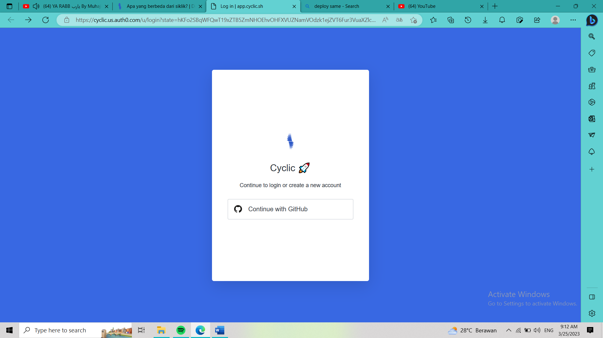
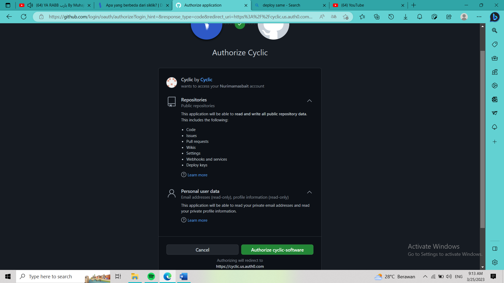
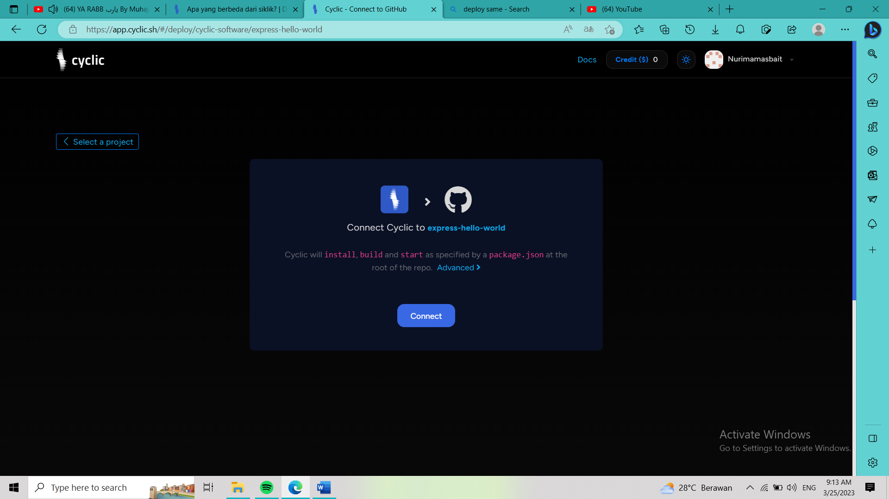

# Deploy to Cyclic
1. Pertma login Cyclic dengan menggunakan akun Github

2. Setelah login selanjutnya akan menampilkan tampilan seperti gambar dibawah ini yang mana untuk membuat repo di github 
3. klik Authorize click software

4. Selanjutnya makan akan menampilkan hasil seperti gambar berikut ini yang mana repo telah terkonek ke cyclic

