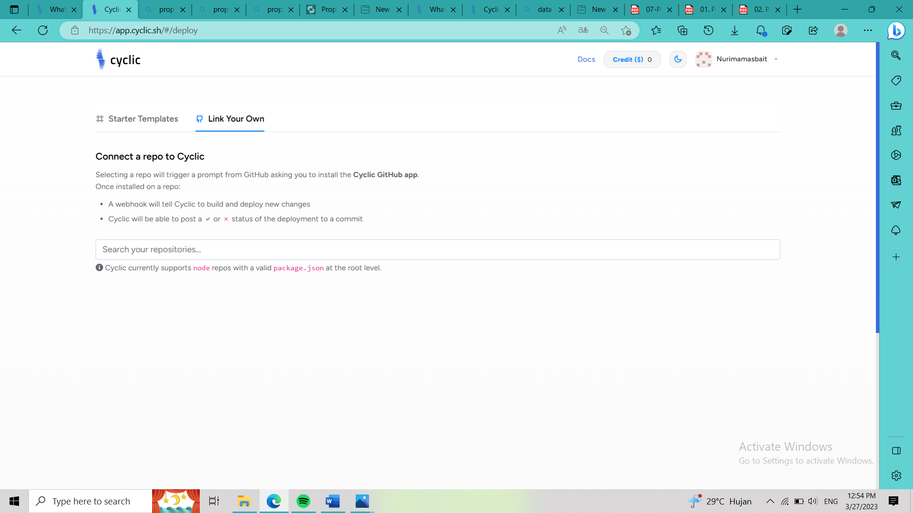
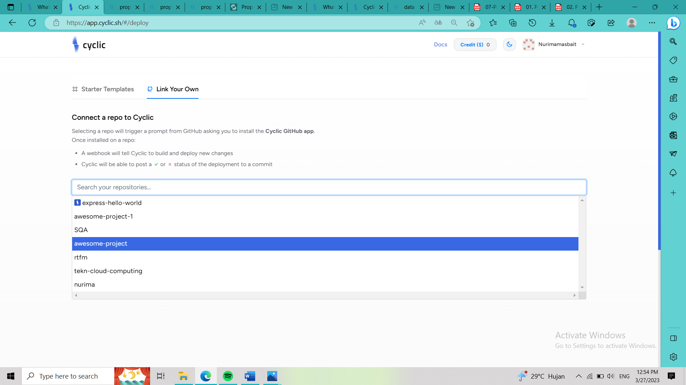
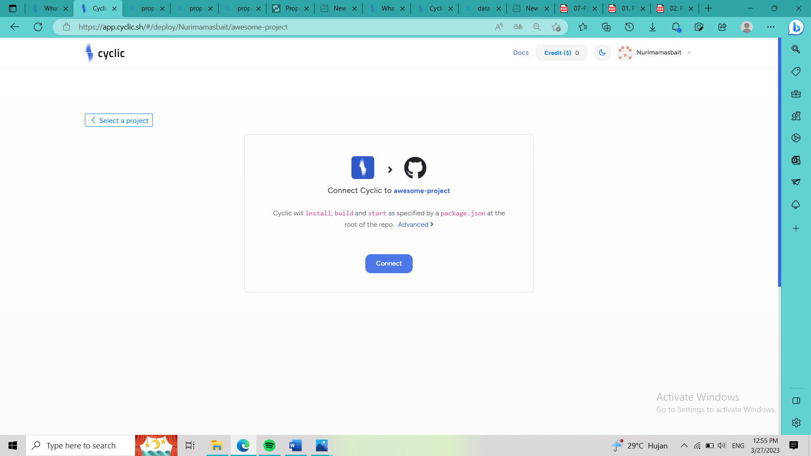
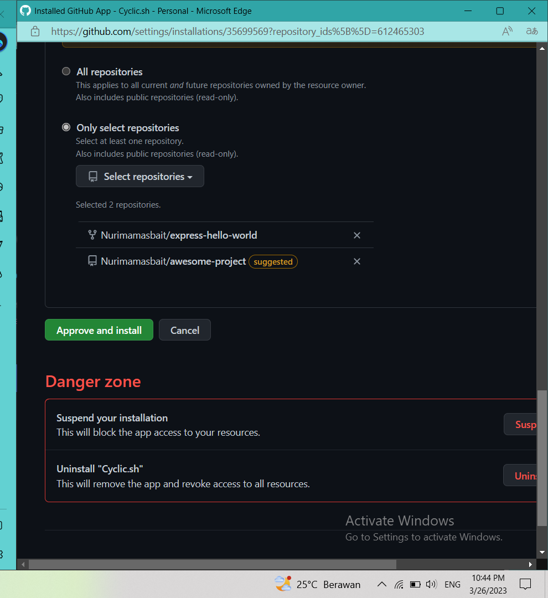
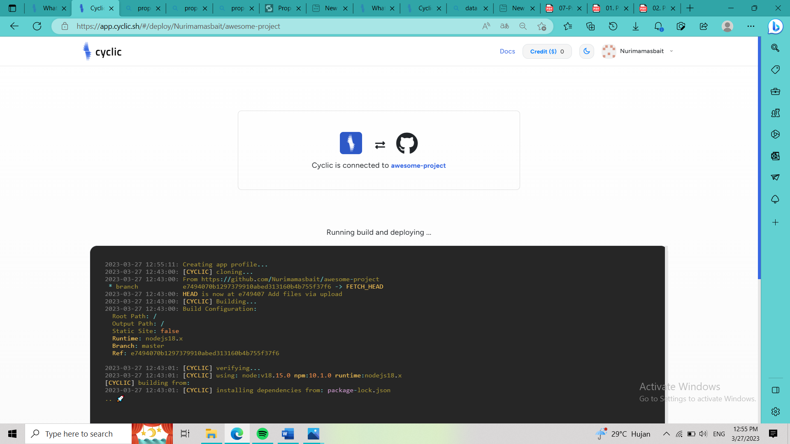
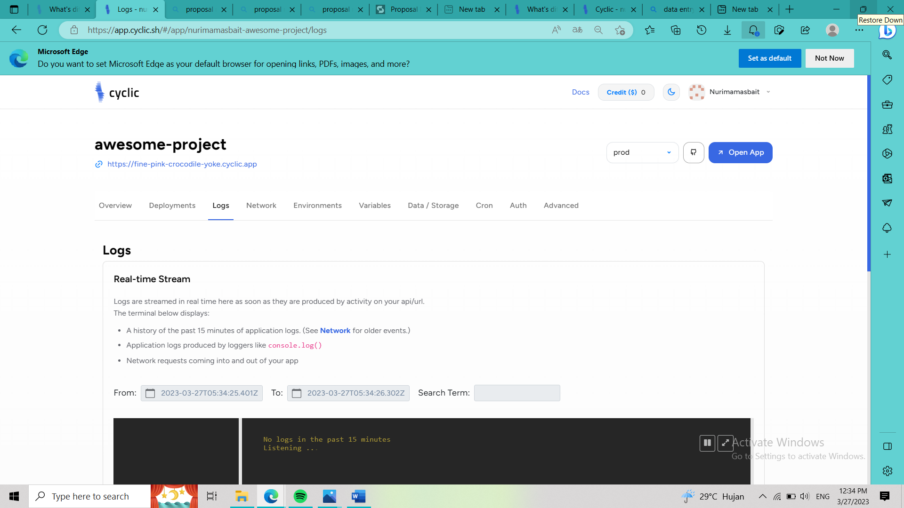

Deploy Some Code - DIY
1. Masuk login app cyclic
2. login app cyclic dengan akun github
3. setelah masuk akan menampilkan sebagai berikut

4. selanjutnya pilih tautan milik saya (Link my own)

5. ketik nama repo anda

6. Klik sebarkan

7. Setujui aplikasi " Cyclic - Preview " di github

 
8. Berikut terminal log penyebaran 

