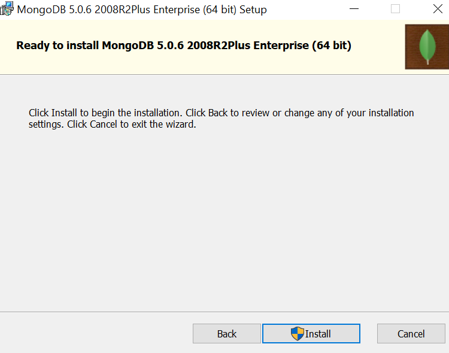

# 1.INSTAL GO, MYSQL DAN MONGODB  
### Instal Go
1. Buka file go yang telah didownload, kemudian klik dan klik run

2. selanjutnya klik next

3. klik next

4. Selanjutnya memilih folder yang ingin anda letakan file Go yang akan diinstal

5. Selanjutnya klik Install

6. Kemudian tunggu sampai proses install selesai

7. Dan setelah selesai klik Finish

8. Setelah terinstal , buka cmd untuk melihat apakah Go sudah terinstal

### Install MYSQL

Jika anda telah install mysql anda dapat melihat perintah untuk melihat version mysql

### Install MongoDB
1. Klik file MongoDB yang telah didownload

2. Selanjutnya klik next

3. Lanjut Next

4. Selanjutnya akan menampilkan Servir Configuration
Pada bagian ini akan di perlihatkan lokasi datanya , bias dilihat pada tanda

5. Hilangkan tanda Install MongoDB Compass dan klik nxt

6. Selanjutnya klik Install

7. Kemudian tunggu proses install selesai

8. Setelah installan selesai maka Finish , setelah itu klik finish

9. Selanjutnya buka Folder MongoDB, kemudian klik mongoDB.exe

10. Maka tampilan mongoDB jika telah seperti di bawah ini maka telah berasil terinstall

# 2. Contoh Program Go masing-masing untuk koneksi dan membaca data dari MySQL dan MongoDB

#### 1. Program Go koneksi MYSQL

Pertama-tama, Kita perlu men-download driver menggunakan go get.

Buat file main.go

Selanjutnya run file main.go dan hasil sukses maka koneksi ke mysql berhasil

Selanjutnya membuat database

Membuat file dengan nama select.go untuk menghubungkan database yang telah dibuat

Selanjutnya run file select.go

#### 2. Program Go koneksi MongoDB

Pertama-tama, Kita perlu men-download driver menggunakan go get.

Membuat file mongodb.go

Selanjutnya run file mongodb.go

# 3. Dengan menggunakan Gin, buatlah RESTful API untuk membaca dara dari MySQL dan MongoDB tersebut

1. Program Main.go

2. Run main untuk akses GIN

3. Hasil

