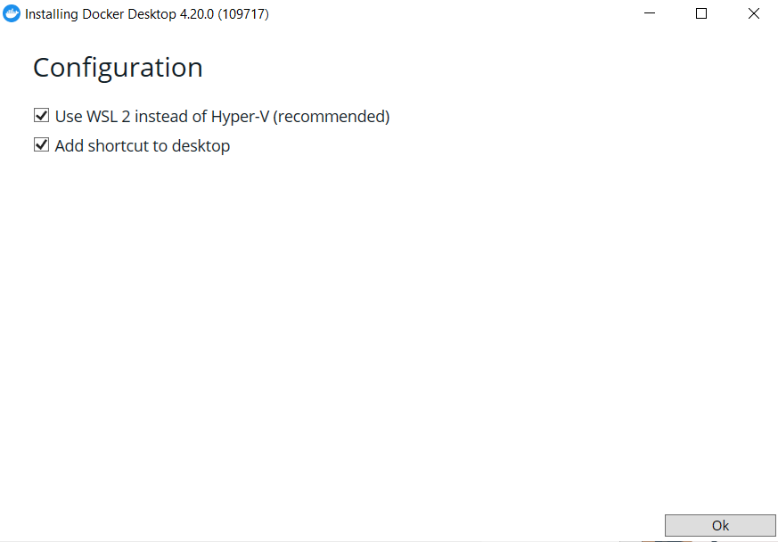
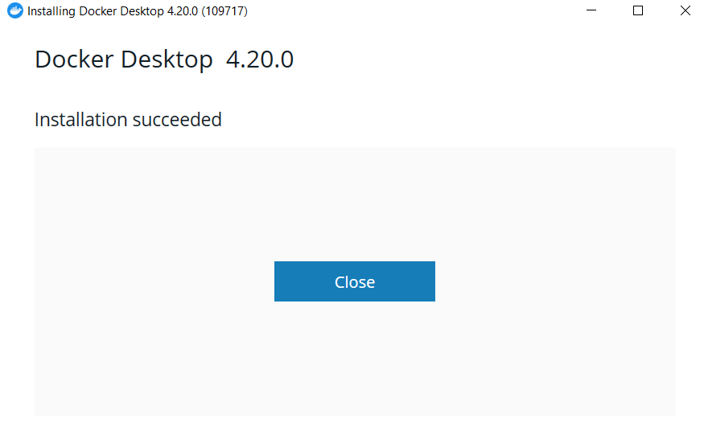

# INSTALL DOCKER
1. Download Docker untuk windows

2. Mulai install docker

3. konfigurasi 

4. Proses install

5. Instalasi selesai
Setelah itu , klik Close and restrart untuk restart komputer

# 2. Get Started - Docker
##  Containerize an application
Gunakan app
Kloning repositori memulai menggunakan perintah berikut:

Lihat konten repositori kloning. Di dalam direktori Anda harus melihat dan dua subdirektori  dan.(getting-started/apppackage.jsonsrcspec)

## Membuat gambar kontainer aplikasi

Di direktori, lokasi yang sama dengan file, buat file bernama . Anda dapat menggunakan perintah berikut di bawah ini untuk membuat Dockerfile berdasarkan sistem operasi Anda.apppackage.jsonDockerfile

Buat gambar kontainer

Login Docker

Mulai kontainer Anda menggunakan perintah dan tentukan nama gambar yang baru saja Anda buat:docker run

Setelah beberapa detik, buka browser web Anda untuk http://localhost:3000. Anda akan melihat aplikasi Anda.

Jalankan perintah berikut di terminal untuk mencantumkan kontainer Anda.docker ps
Dan hasilnya sebagai berikut

