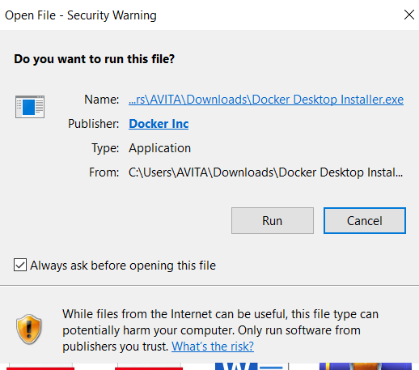
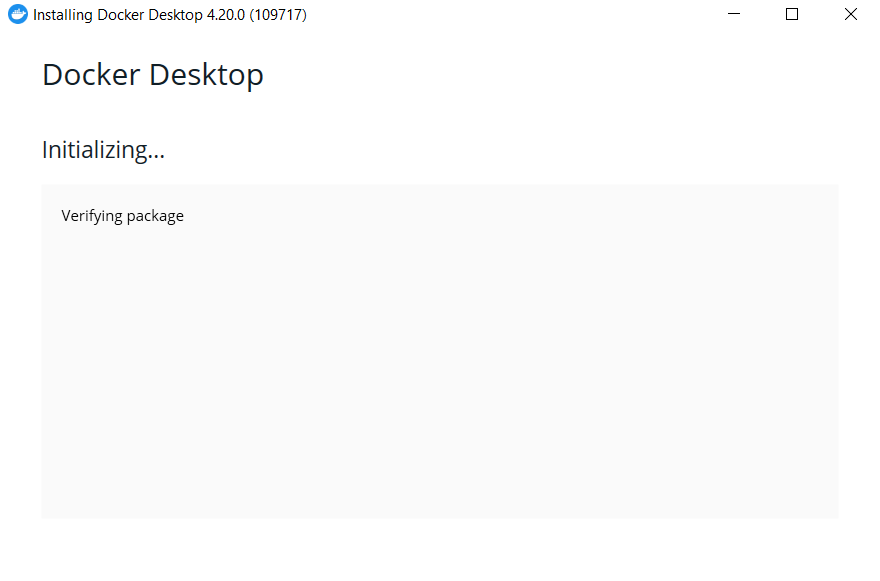
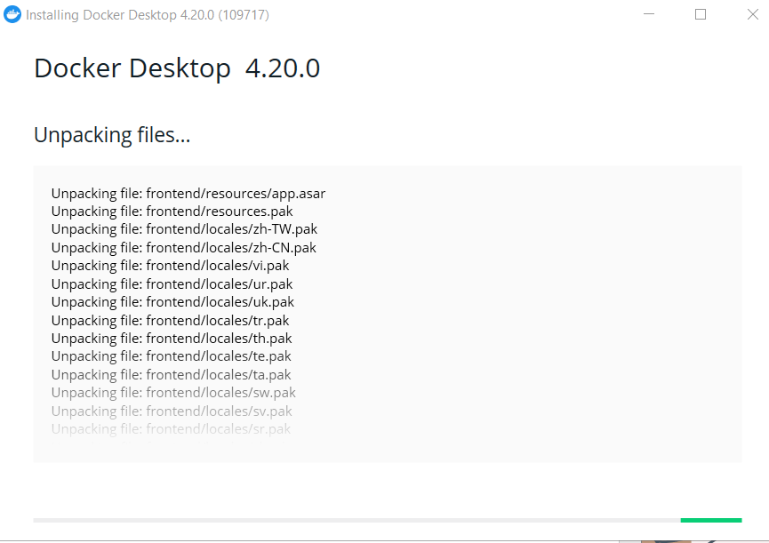
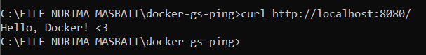
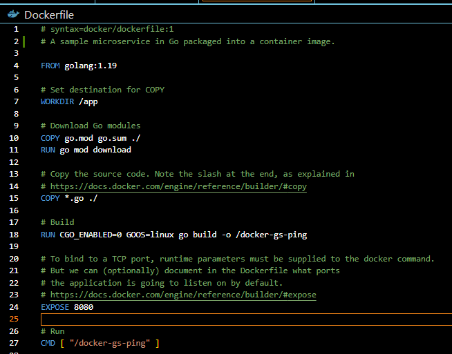
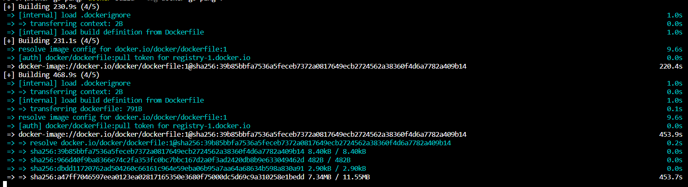

# INSTALL DOCKER
1. Download Docker untuk windows

2. Mulai install docker

3. konfigurasi 

4. Proses install

5. Instalasi selesai
Setelah itu , klik Close and restrart untuk restart komputer

# 2. Get Started - Docker
## Menggunakan Golang 
1. Mengkloning repository aplikasi ke mesin lokal :

2. Ran file main.go akan menampilkan seperti diwabah ini

3. tes dengan aplikasi 

## Membuat Docker untuk aplikasi

File : Dockerfile

Tambah komentar yang berada di bagian ke dua

## Membangun Gambar
Mulai Buat gambar docker pertama dengan perintah berikut

Berikut proses akan mencetak beberapa diagnostik untuk melalui langkah - langkah build

