Buat direktori untuk proyek:

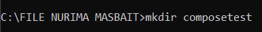

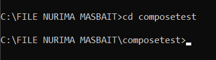

Buat file yang dipanggil di direktori proyek Anda dan tempelkan kode berikut di:app.py

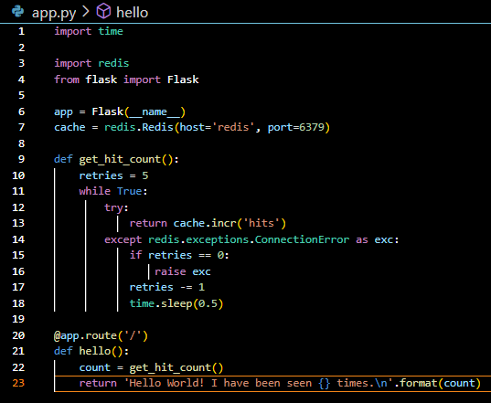

Buat file lain yang dipanggil di direktori proyek Anda dan Tempel kode berikut di:requirements.txt

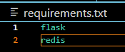

Di direktori proyek Anda, buat file bernama dan tempelkan kode berikut di:Dockerfile

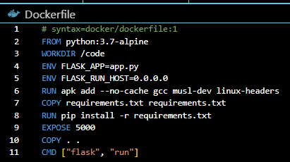

Dari direktori proyek Anda, mulai aplikasi Anda dengan menjalankan .docker compose up

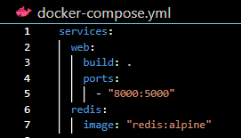

login docker

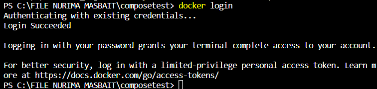

Dari direktori proyek Anda, mulai aplikasi Anda dengan menjalankan .docker compose up

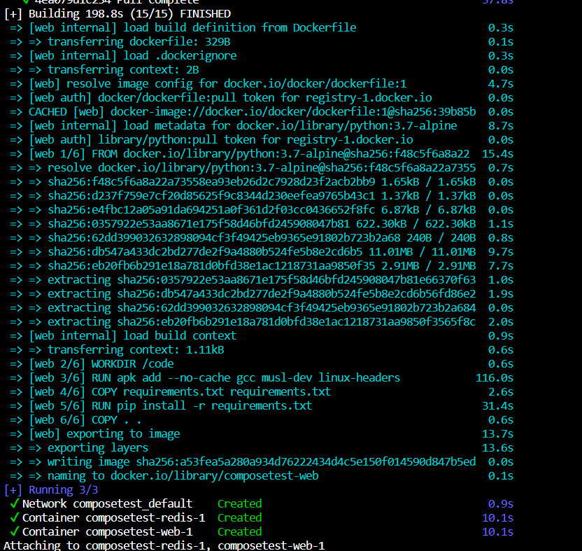

Masukkan http://localhost:8000/ di browser untuk melihat aplikasi berjalan.

Jika ini tidak teratasi, Anda juga dapat mencoba http://127.0.0.1:8000.

Anda akan melihat pesan di browser Anda yang mengatakan:

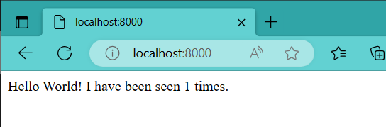

Refresh halaman.

Jumlahnya harus bertambah

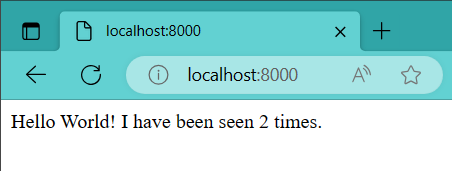

Beralih ke jendela terminal lain, dan ketik untuk mencantumkan gambar lokal.docker image ls

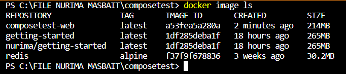

Edit di direktori proyek Anda untuk menambahkan pemasangan pengikatan untuk layanan:docker-compose.ymlweb

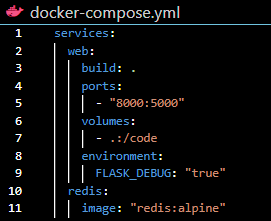

Dari direktori project, ketik untuk mem-build aplikasi dengan file Compose yang diperbarui, lalu jalankan.docker compose up

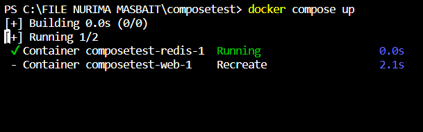
Ubah salam dan simpan. Misalnya, ubah pesan menjadi :app.pyHello World!Hello from Docker!

return 'Hello from Docker! I have been seen {} times.\n'.format(count)

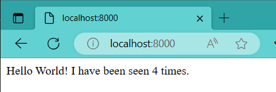

Jika Anda ingin menjalankan layanan Anda di latar belakang, Anda dapat meneruskan bendera (untuk mode "terpisah") ke dan gunakan untuk Lihat apa yang sedang berjalan:-ddocker compose updocker compose ps

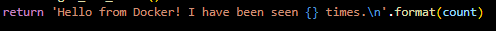

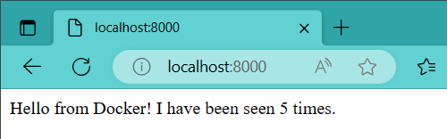

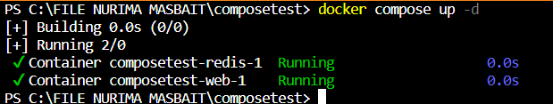

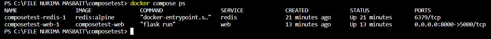

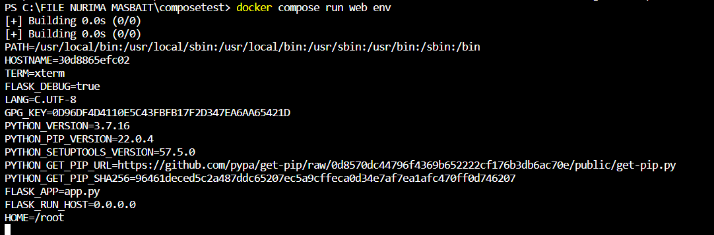

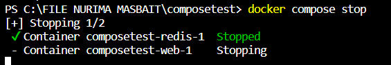

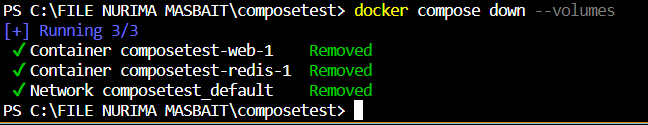

