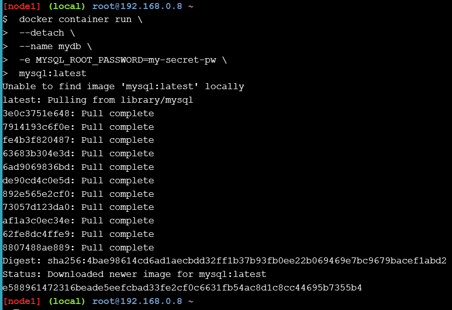
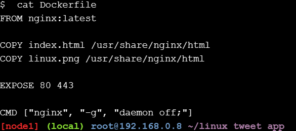
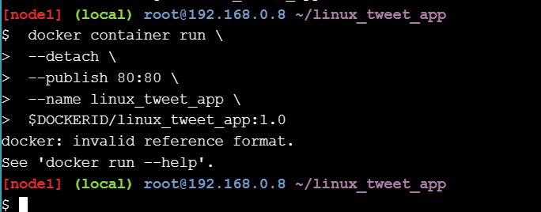
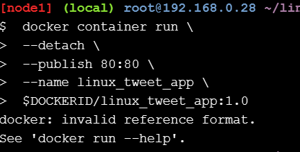
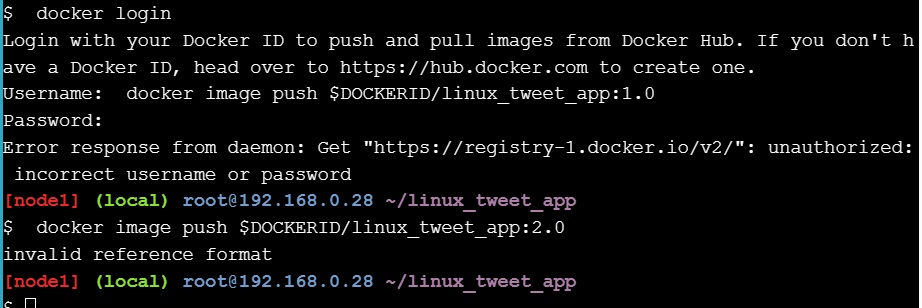

Mengkloning Repo GitHub Lab
Gunakan perintah berikut untuk mengkloning repositori lab dari GitHub (Anda dapat mengklik perintah atau mengetiknya secara manual). Ini akan membuat salinan repo lab di sub-direktori baru yang disebut .linux_tweet_app

Menjalankan beberapa kontainer Docker sederhana
Menjalankan satu tugas dalam kontainer Alpine Linux
Pada langkah ini kita akan memulai kontainer baru dan menyuruhnya menjalankan perintah. Kontainer akan mulai, jalankan perintah, lalu keluar.hostnamehostname
Jalankan perintah berikut di konsol Linux Anda.

Docker menjaga kontainer tetap berjalan selama proses yang dimulai di dalam kontainer masih berjalan. Dalam hal ini, proses keluar segera setelah output ditulis. Ini berarti kontainer berhenti. Namun, Docker tidak menghapus sumber daya secara default, sehingga kontainer masih ada di negara bagian.hostnameExited
Cantumkan semua kontainer.

Menjalankan kontainer Ubuntu interaktif
Jalankan kontainer Docker dan akses shell-nya.
Dalam contoh ini, kami memberi Docker tiga parameter:
•	--interactive mengatakan Anda ingin sesi interaktif.
•	--tty mengalokasikan pseudo-tty.
•	--rm memberitahu Docker untuk melanjutkan dan menghapus kontainer setelah selesai mengeksekusi.

Jalankan perintah berikut dalam kontainer.
ls / akan mencantumkan isi direktori root dalam wadah, akan menampilkan proses yang berjalan dalam wadah, akan menunjukkan distro Linux mana yang dijalankan wadah, dalam hal ini Ubuntu 20.04.3 LTS.ps auxcat /etc/issue

Ketik untuk meninggalkan sesi shell. Ini akan menghentikan proses, menyebabkan kontainer keluar.exitbash

Ketik untuk meninggalkan sesi shell. Ini akan menghentikan proses, menyebabkan kontainer keluar.exitbash

Menjalankan kontainer MySQL latar belakang
Jalankan kontainer MySQL baru dengan perintah berikut.
•	--detach akan menjalankan kontainer di latar belakang.
•	--name akan menamainya mydb.
•	-e akan menggunakan variabel lingkungan untuk menentukan kata sandi root (CATATAN: Ini tidak boleh dilakukan dalam produksi).

Cantumkan kontainer yang sedang berjalan.

Anda dapat memeriksa apa yang terjadi di kontainer Anda dengan menggunakan beberapa perintah Docker bawaan: dan .docker container logsdocker container top

Mari kita lihat proses yang berjalan di dalam wadah

Cantumkan versi MySQL menggunakan .docker container exec

Anda juga dapat menggunakannya untuk menyambungkan ke proses shell baru di dalam kontainer yang sudah berjalan. Menjalankan perintah di bawah ini akan memberi Anda shell interaktif () di dalam kontainer MySQL Anda.docker container execsh

Mengemas dan menjalankan aplikasi kustom menggunakan Docker
Pastikan Anda berada di direktori.linux_tweet_app

Menampilkan konten Dockerfile

Gema nilai variabel kembali ke terminal untuk memastikannya disimpan dengan benar.

