# PERTEMUAN 10
 # Dasar-dasar Jaringan
Perintah Jaringan Docker
Perintah adalah perintah utama untuk mengkonfigurasi dan mengelola jaringan kontainer. Jalankan perintah dari terminal pertama.docker networkdocker network

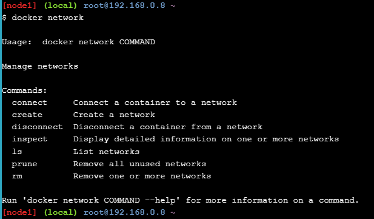

Daftar jaringan
Jalankan perintah untuk melihat jaringan kontainer yang ada di host Docker saat ini.docker network ls

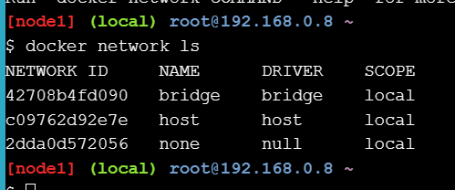

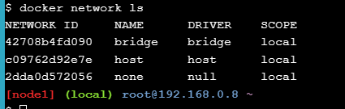

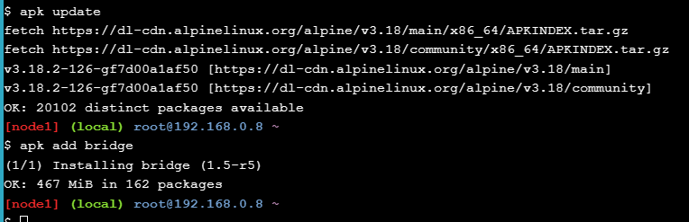

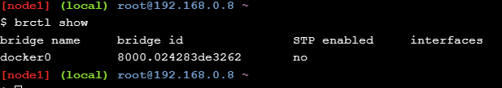

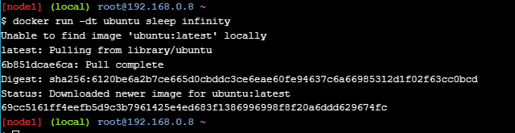
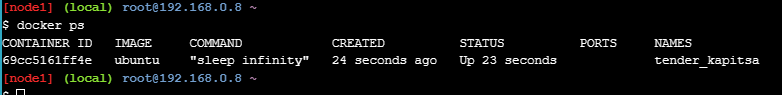
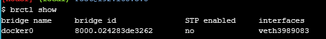
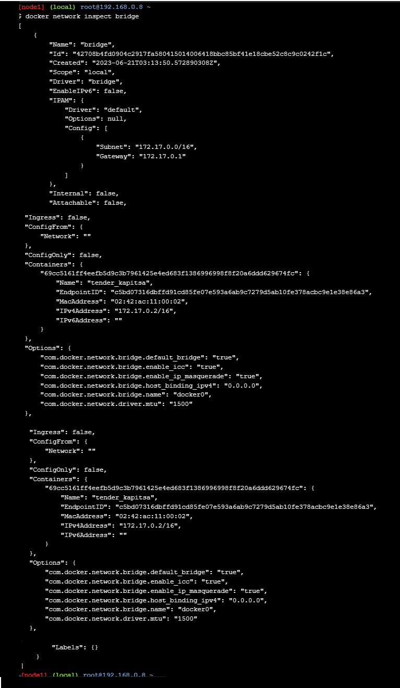
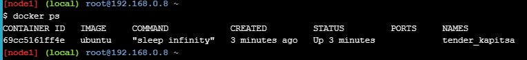
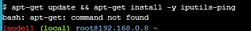
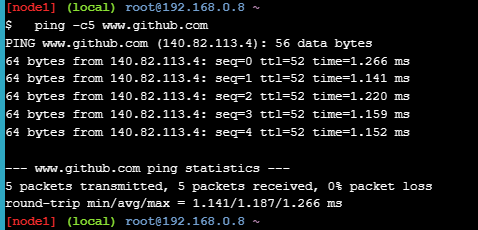
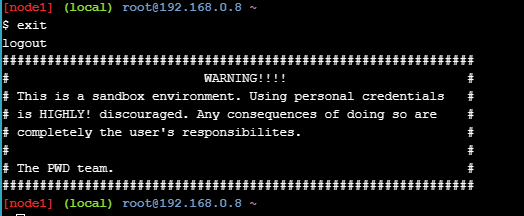
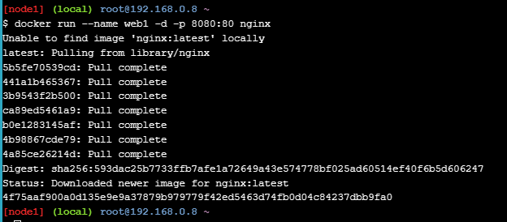

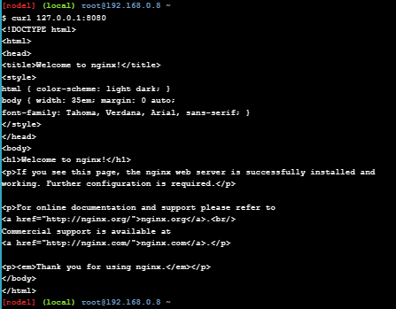
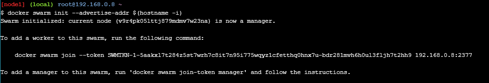
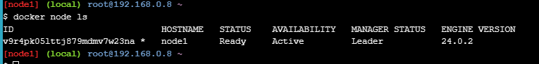
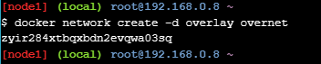
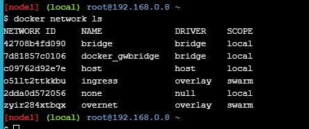
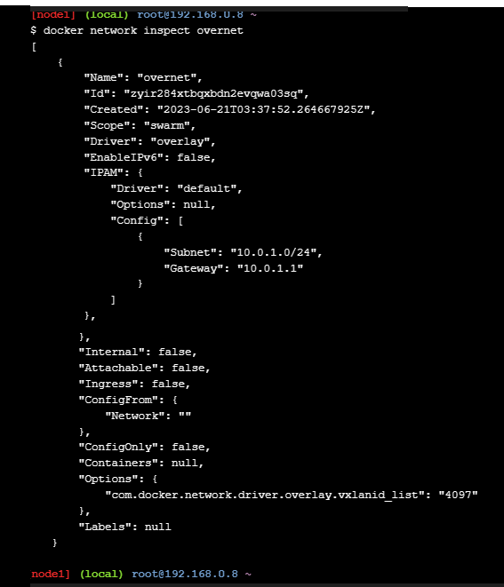

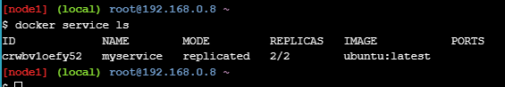
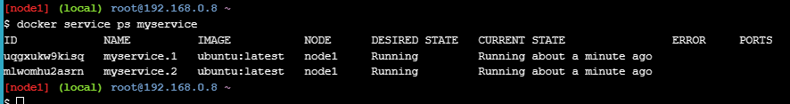
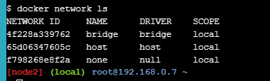
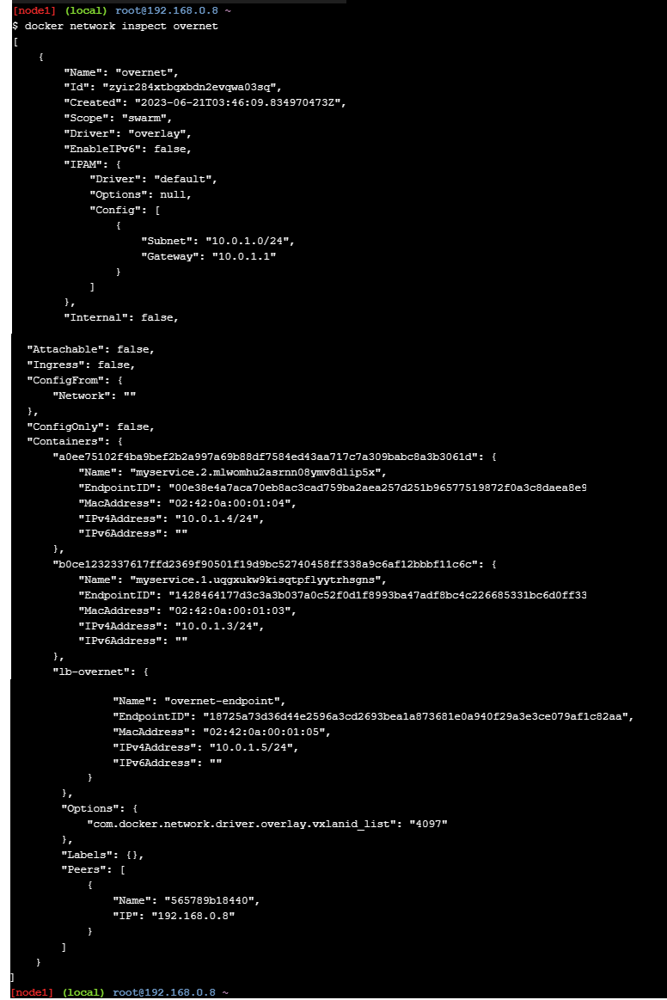
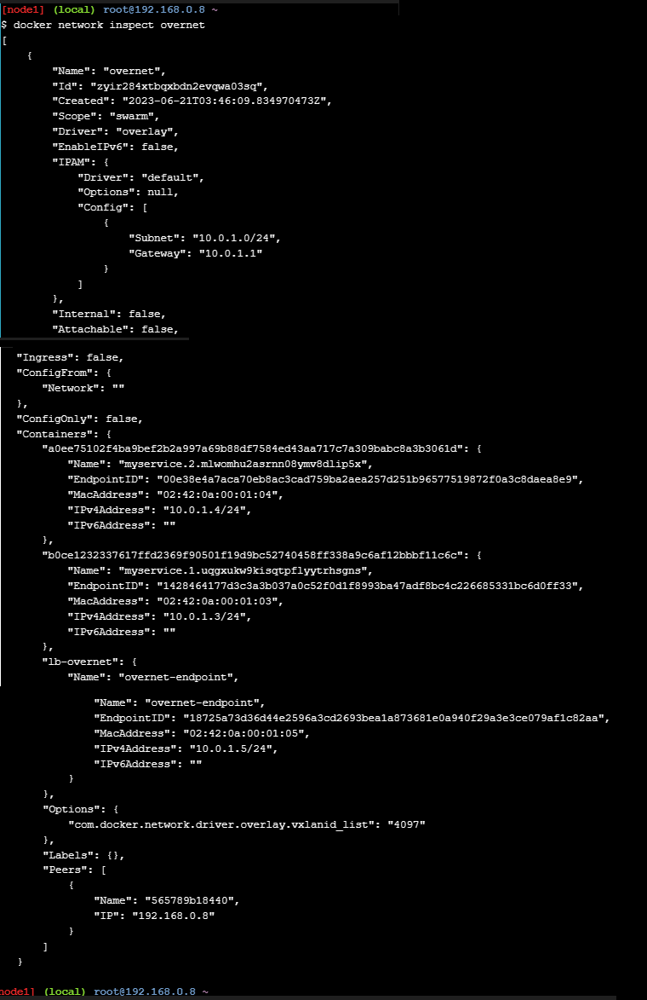
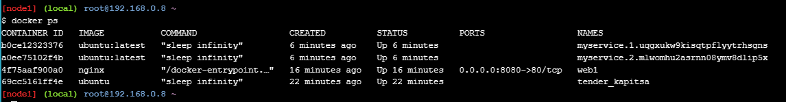
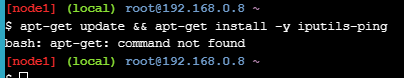
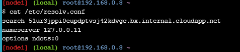
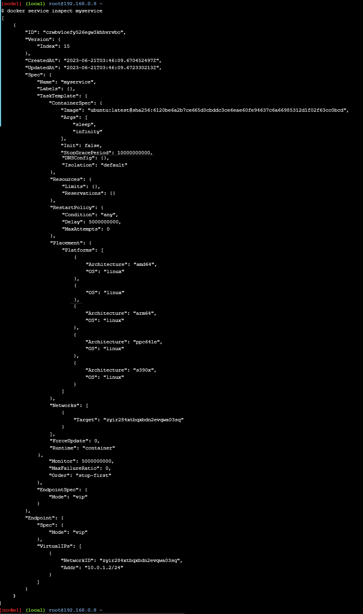
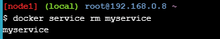

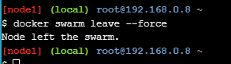
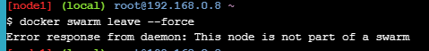
