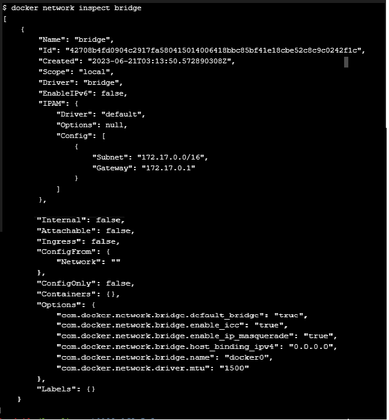
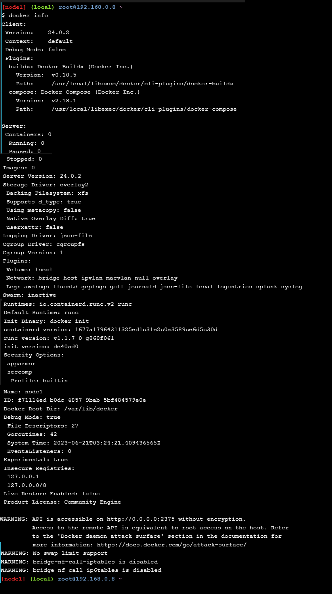
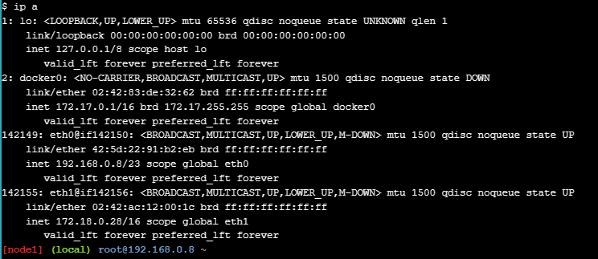
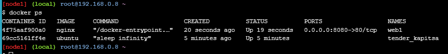
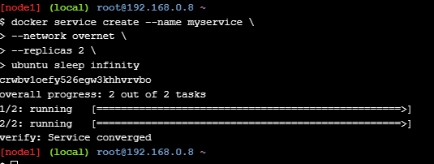
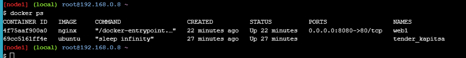

# PERTEMUAN 10
 # Dasar-dasar Jaringan
Perintah Jaringan Docker
Perintah adalah perintah utama untuk mengkonfigurasi dan mengelola jaringan kontainer. Jalankan perintah dari terminal pertama.docker networkdocker network

Daftar jaringan
Jalankan perintah untuk melihat jaringan kontainer yang ada di host Docker saat ini.docker network ls

Periksa jaringan
Perintah ini digunakan untuk melihat detail konfigurasi jaringan

Daftar plugin driver jaringanV
Perintah menunjukkan banyak informasi menarik tentang instalasi Docke

Jaringan Jembatan
Dasar-dasar
Setiap instalasi Docker yang bersih dilengkapi dengan jaringan pra-bangun yang disebut bridge. Verifikasi ini dengan ekstensi .docker network lsV

Output di atas menunjukkan bahwa jaringan bridge dikaitkan dengan driver bridge dan juga menunjukkan bahwa jaringan jembatan dicakup secara lokal. Ini berarti bahwa jaringan hanya ada di host Docker ini. Ini berlaku untuk semua jaringan yang menggunakan driver bridge - driver bridge menyediakan jaringan host tunggal.

Instal perintah dan gunakan untuk membuat daftar jembatan Linux di host Docker Anda. Anda dapat melakukan ini dengan menjalankan file .brctlsudo apt-get install bridge-utils

Kemudian, daftarkan bridge di host Docker Anda, dengan menjalankan .brctl show
Output berikut menunjukkan satu jembatan Linux yang disebut docker0. Ini adalah jembatan yang secara otomatis dibuat untuk jaringan jembatan. Anda dapat melihat bahwa ia tidak memiliki antarmuka yang saat ini terhubung dengannya.

perintah untuk melihat detail bridge docker0

Menyambungkan kontainer
Jaringan bridge adalah jaringan default untuk kontainer baru. Ini berarti bahwa kecuali Anda menentukan jaringan yang berbeda, semua kontainer baru akan terhubung ke jaringan jembatan

Perintah ini akan membuat kontainer baru berdasarkan gambar dan akan menjalankan perintah untuk menjaga kontainer tetap berjalan di latar belakang.

Jalankan perintah lagi.brctl show

melihat kontainer baru yang terpasang

Uji konektivitas jaringan
Output ke perintah sebelumnya menunjukkan alamat IP kontainer baru

Balasan di atas menunjukkan bahwa host Docker dapat melakukan ping ke kontainer melalui jaringan bridge. Tapi, kami juga dapat memverifikasi kontainer dapat terhubung ke dunia luar juga

