# Application Containerization and Microservice Orchestration

Pada pertemuan ini mempelajari tentang containerization aplikasi dasar menggunakan Docker dan menjalankan berbagai komponen aplikasi sebagai layanan mikro. Pada praktik kali ini mengguanakan Docker Compose untuk orkestrasi selama pengembangan
## Stage Setup
Pada tahap pertama mengkloning repositori kode demo mengubah direktori kerja, dan memeriksa cabangnya.demo

## Basic Link Extractor Script
Dalam tahap ini memeriksa cabang dan daftar file didalam step0

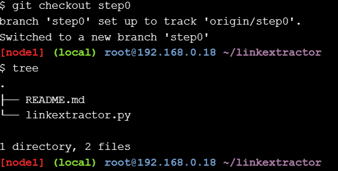

berikut ini melihat isi dari file linkextractor.py

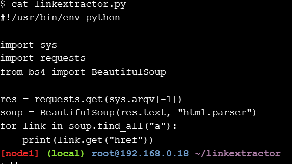

dari hasil di atas merupakan scrip Python yang mengimpor tiga paket yaitu from the standard library and two popular third-party packages and. 
Dari file diatas ternyata  merupakan file yang tidak memenuhi persyaratannya ntuk dijalankan pada mesin
Berikut merupakan file yang menyarankan cara menjalankan

pada file diatas terdapat kesalahan dengan itu perlu memeriksa izin pada file ini:Permission denied. Untuk pemeriksaan dapat menjalankan perintah berikut

dari hasil menjalankan perintah di atas menunjukan bahwa skrip tidak diatur untuk dapat dieksekusi. Oleh sebab itu dapat mengubahnya dengan menjalankan atau menjalankannya sebagai program Python alih-alih skrip yang dijalankan sendiri seperti yang di hasilkan seperti diatas

Pada tahap di atas tersebut mendapat pesan pertama yaitu kehilangan paket pihak ketiga yang dibutuhkan oleh skrip. Dengan itu dapat menginstal paket Python  (dan berpotensi paket lain yang hilang) menggunakan salah satu dari banyak teknik untuk membuatnya bekerja, tetapi terlalu banyak pekerjaan untuk skrip sederhana seperti itu, memungkinkan tidak jelas bagi mereka yang tidak terbiasa dengan ekosistem Python.

## Containerized Link Extractor Script
Dalam tahap ini memeriksa cabang dan daftar file didalam step1

Berikut menambahkan satu file baru

Dari tahap diatas dapat menyiapkan Docker image untuk skrip.

Berikut menggambarkan Docker image tetapi tidak benar-benar membangunnya

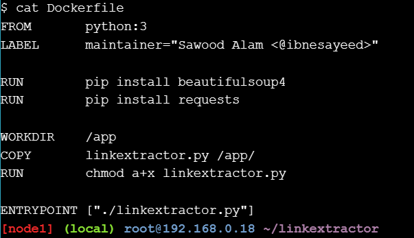

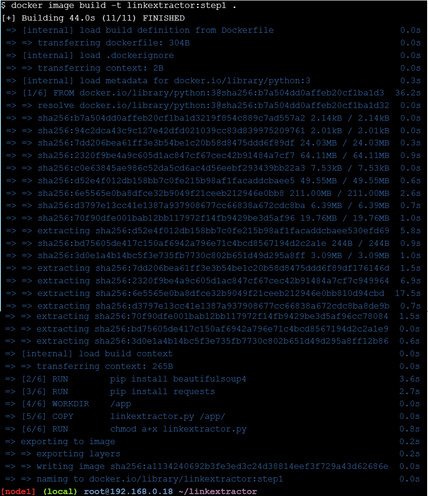

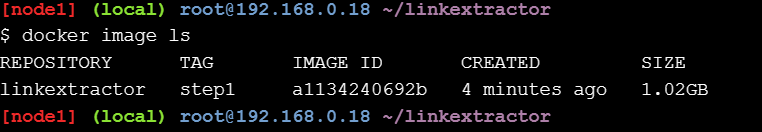

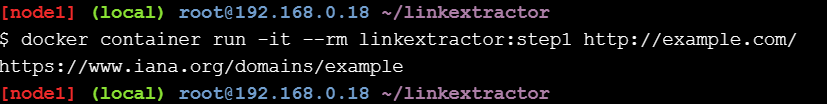

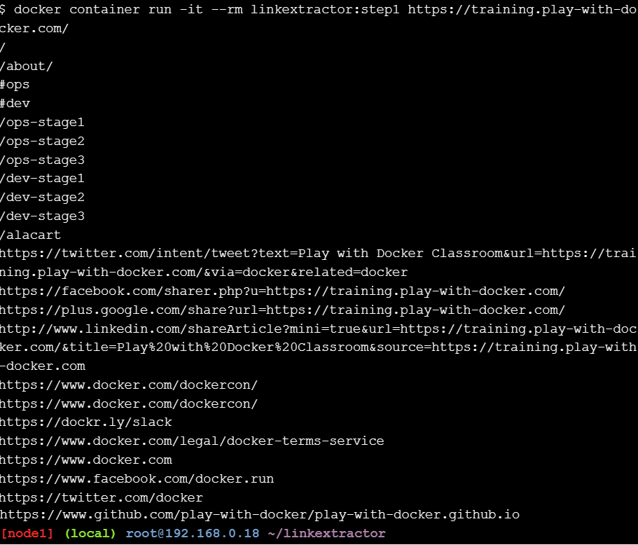

## Link Extractor Module with Full URI and Anchor Text
Dalam tahap ini memeriksa cabang dan daftar file didalam step2

Dalam langkah ini skrip diperbarui dengan perubahan fungsional berikut:linkextractor.py

1. Jalur dinormalisasi ke URL lengkap
2. Melaporkan tautan dan teks jangkar
3. Dapat digunakan sebagai modul dalam skrip lain

Berikut  melihat scrip yang telah diperbarui 

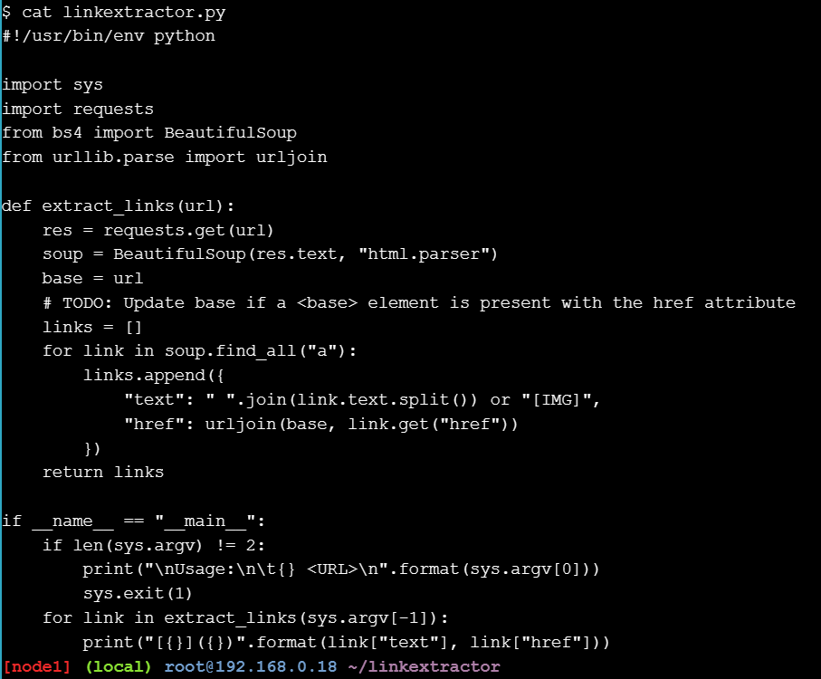

Berikut membuat image baru dan melihat perubahan

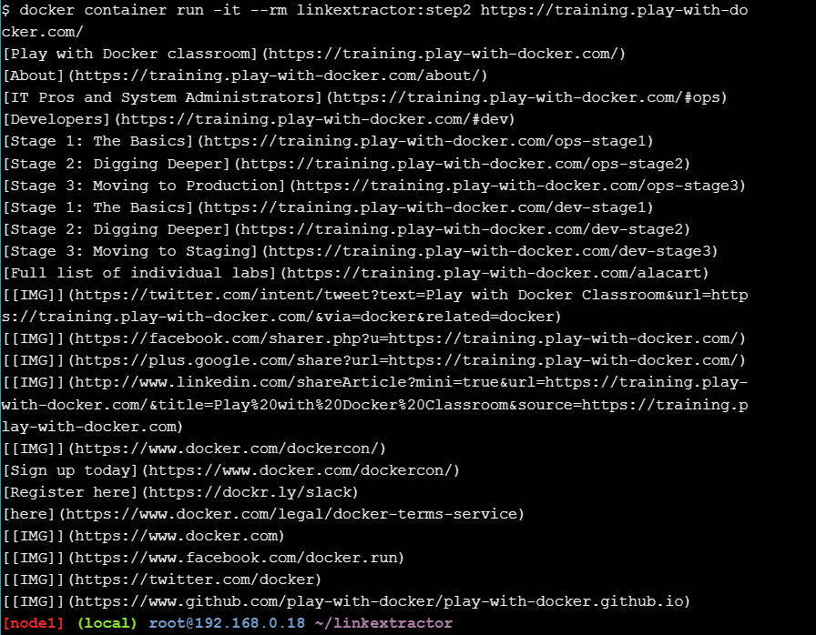

## Link Extractor API Service

Perubahan berikut telah dibuat dalam langkah ini:

1. Menambahkan skrip server yang menggunakan modul ekstraksi tautan yang ditulis pada langkah terakhirmain.py
2. Diperbarui untuk merujuk ke file sebagai gantinyaDockerfilemain.py
3. Server dapat diakses sebagai WEB API di http://<hostname>[:<prt>]/api/<url>
4. Dependensi dipindahkan ke filerequirements.txt
5. Perlu pemetaan port untuk membuat layanan dapat diakses di luar kontainer (server yang digunakan di sini mendengarkan port secara default)Flask5000

Berikut melihat perubahannya:Dockerfile

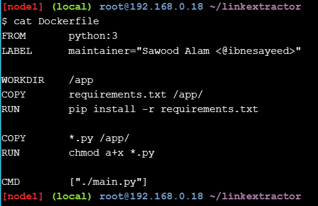

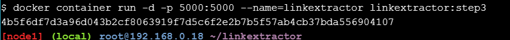

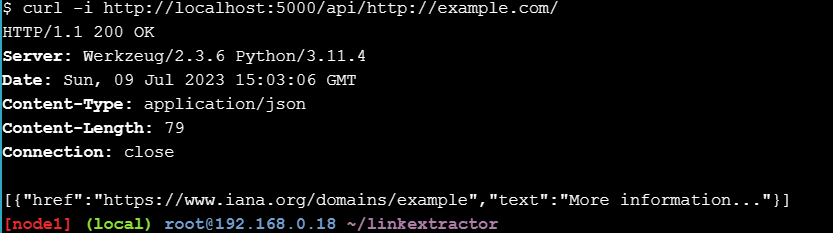

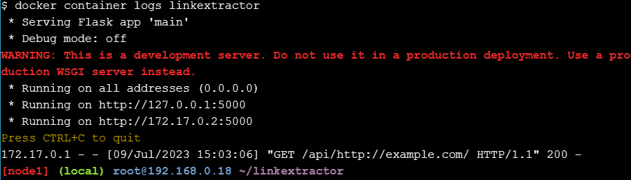

## Link Extractor API and Web Front End Services

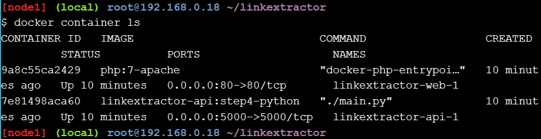

Berikut mengakses web http://example.com/ ,Dengan itu menjalankan perintah berikut untuk dapat mengakses link 

setelah perintah dijalankan http://example.com/ , maka akan menampilkan seperti dibawah ini

kemudian isi dengan autan berikut .https://training.play-with-docker.com/

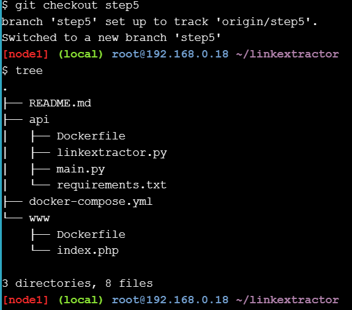

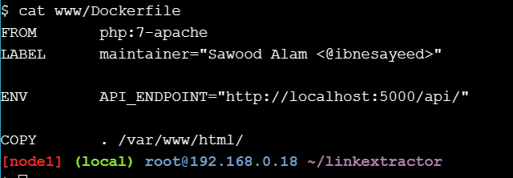

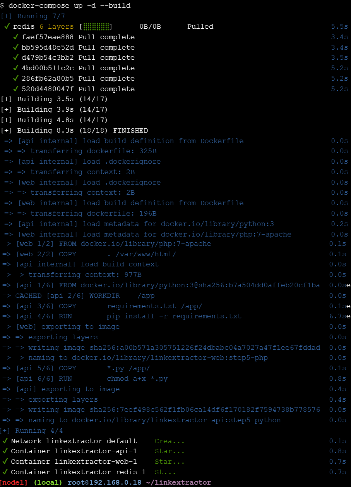

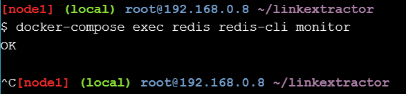

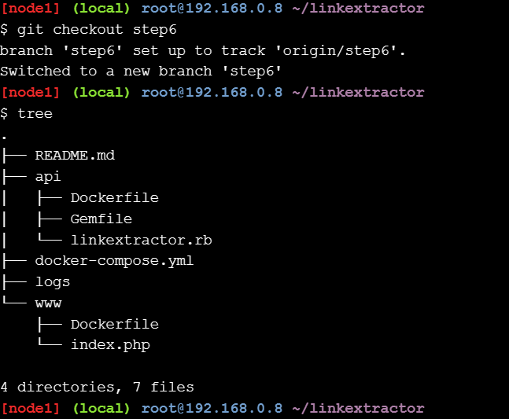

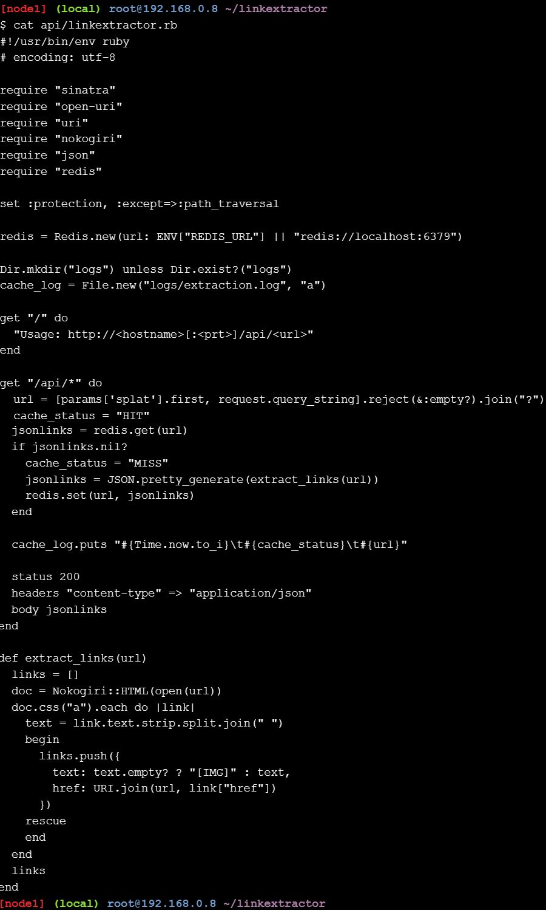

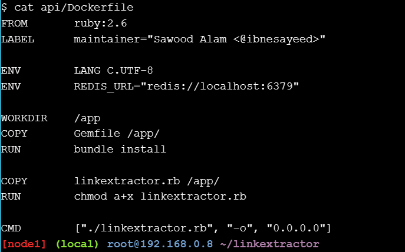

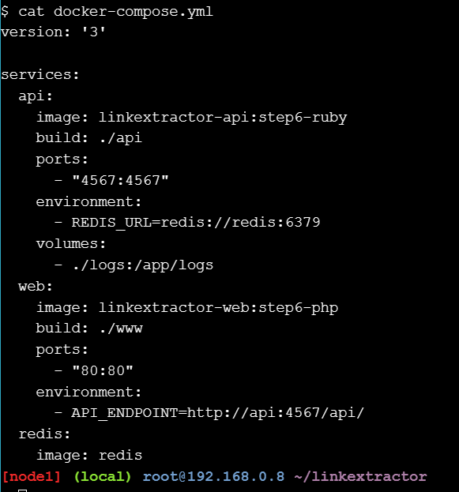

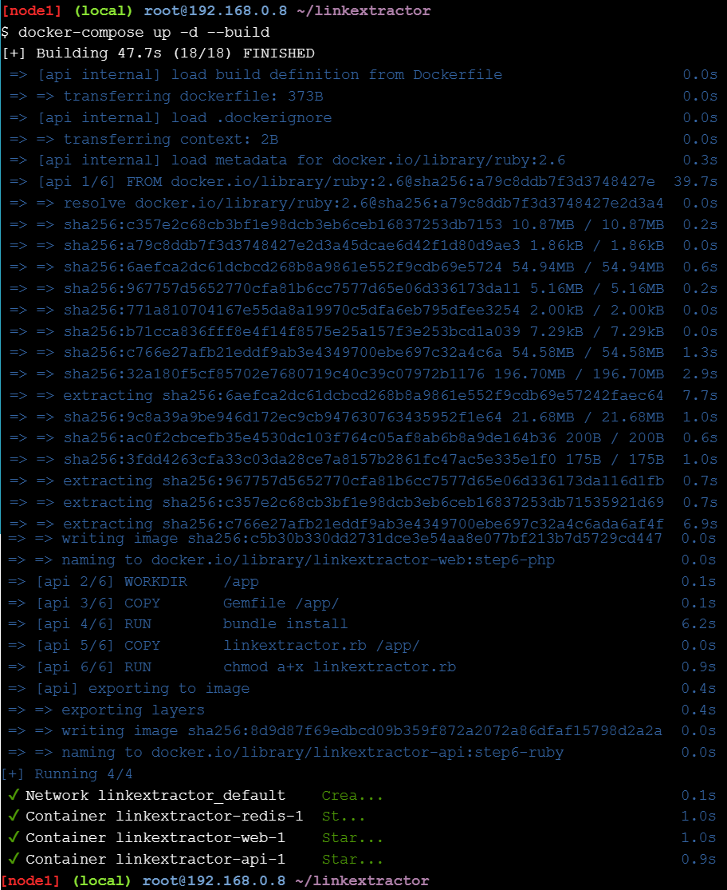

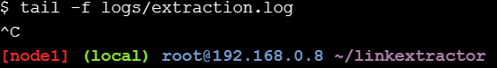

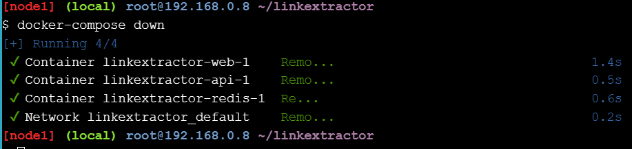

