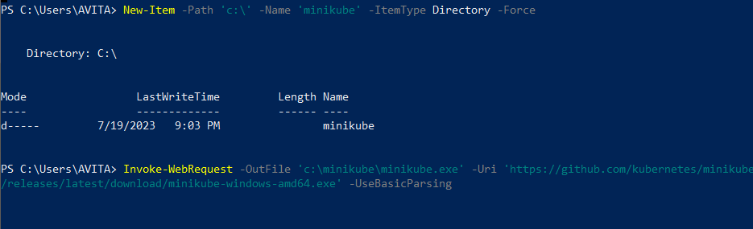
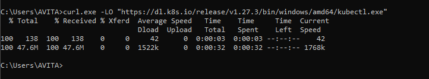

# Kubernetes
## Instal Minikuber

Menggunakan perintah ini:PowerShell

Selanjutnya tambahkan biner ke file .
Pastikan untuk menjalankan PowerShell sebagai Administrator.minikube.exePATH

## Install kubectl

Setelah install Minikuber dan kubectl ,selanjutnya membuat minikube cluster

## Create a minikube cluster

## Create a Deployment

