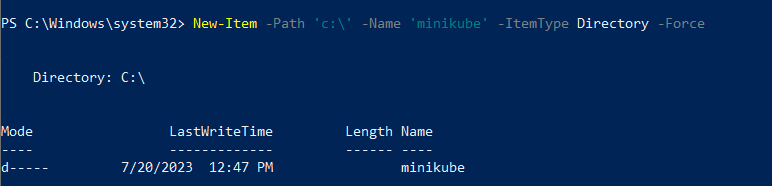
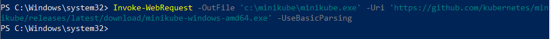
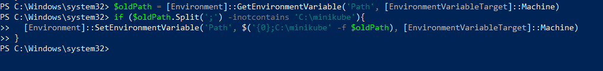
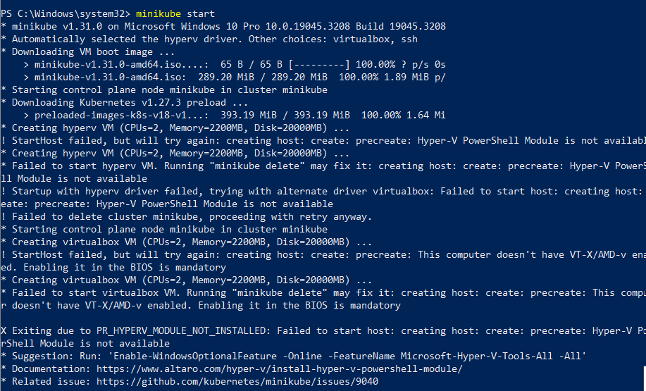
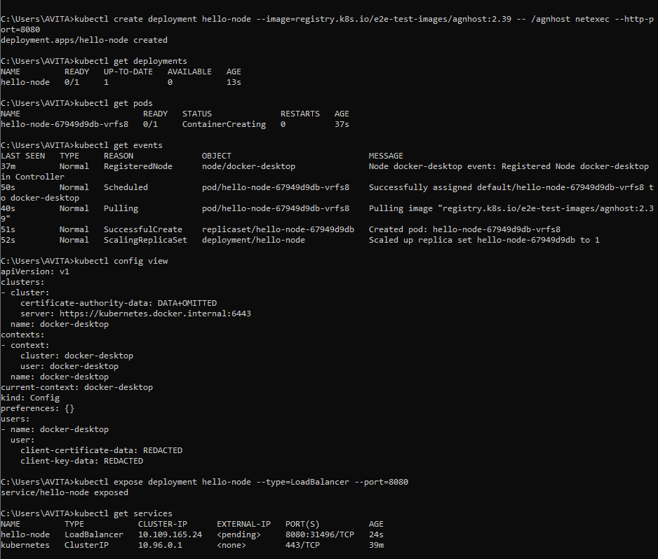

# Kubernetes
## Instal Minikuber

Menggunakan perintah ini:PowerShell

Selanjutnya tambahkan biner ke file .
Pastikan untuk menjalankan PowerShell sebagai Administrator.minikube.exePATH

## Instal kubectl binary with curl di Windows

Perintah ini:curl

Perintah Memvalidasi biner (opsional)
Unduh file checksum:kubectl

Uji untuk memastikan versi sama dengan yang diunduh:kubectl

Setelah install Minikuber dan kubectl ,selanjutnya membuat minikube cluster

## Create a minikube cluster

## Create a Deployment

