# Kubernetes
## Instal Minikuber

Menggunakan perintah ini:PowerShell

Selanjutnya tambahkan biner ke file .

Pastikan untuk menjalankan PowerShell sebagai Administrator.minikube.exePATH

## Instal kubectl binary with curl di Windows

Perintah ini:curl

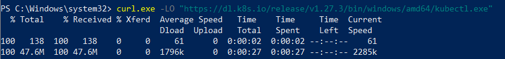

Validasi biner terhadap file checksum:kubectl
Menggunakan Command Prompt untuk membandingkan output secara manual dengan file checksum yang diunduh:CertUtil

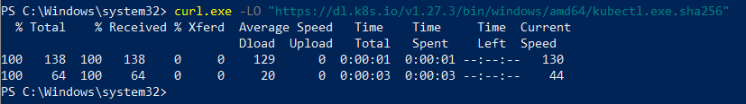

Menggunakan PowerShell untuk mengotomatiskan verifikasi menggunakan operator untuk Dapatkan hasil OR

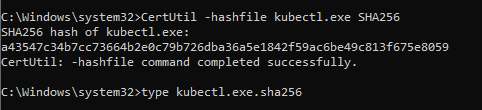

Perintah Memvalidasi biner (opsional)
Unduh file checksum:kubectl

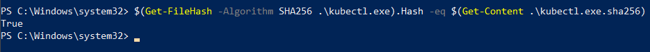

Uji untuk memastikan versi sama dengan yang diunduh:kubectl

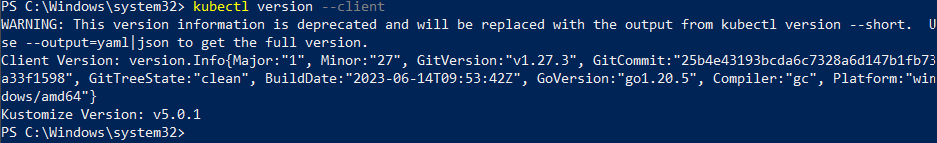

Atau gunakan ini untuk tampilan versi yang terperinci:

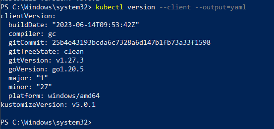

Setelah install Minikuber dan kubectl ,selanjutnya membuat minikube cluster

## Create a minikube cluster

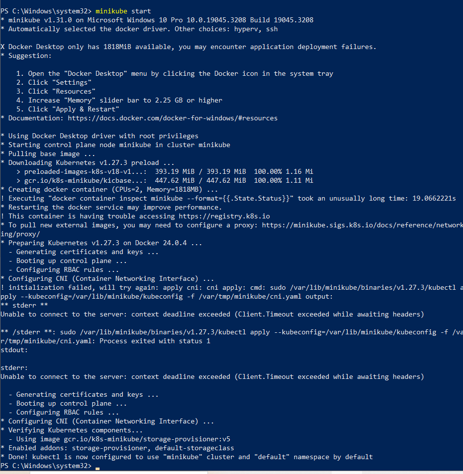

## Open the Kubernetes dashboard

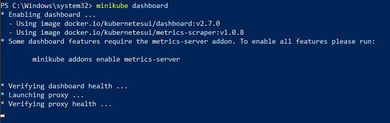

## Create a Deployment

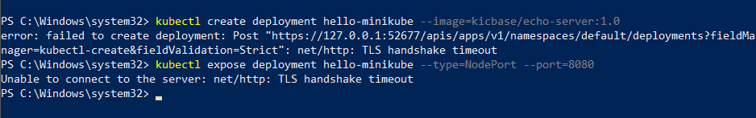

View the Deployment:

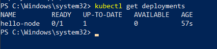

View the Pod:

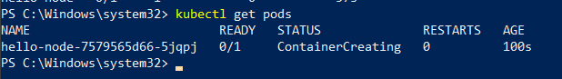

View cluster events

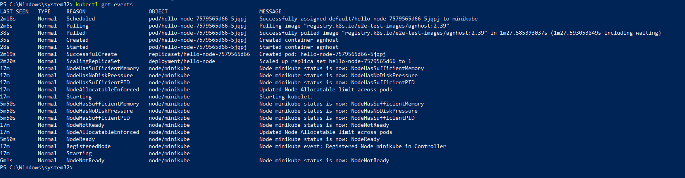

View the kubectl configuration

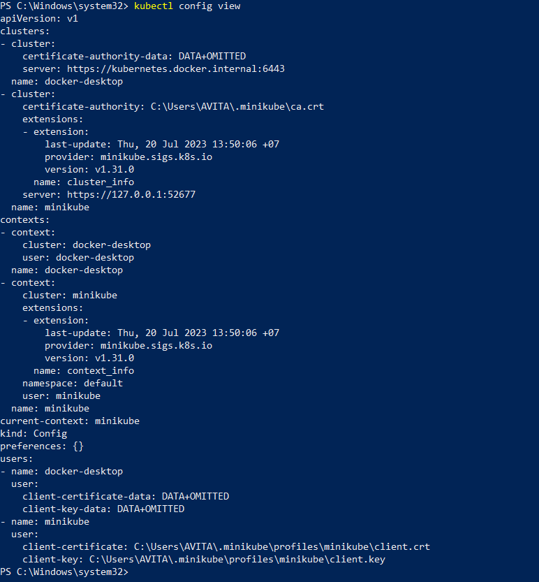

## Create a Service

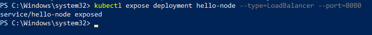

View the Service you created:

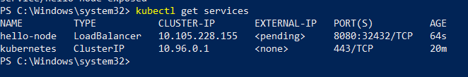

Run the following command:

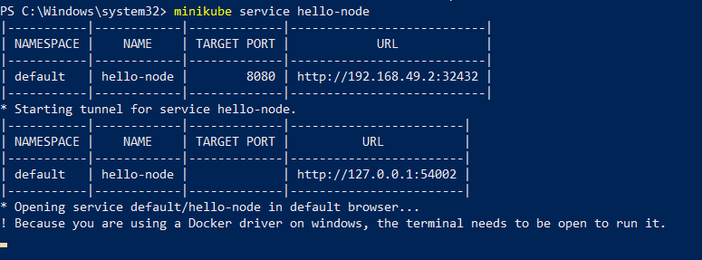

Hasil 

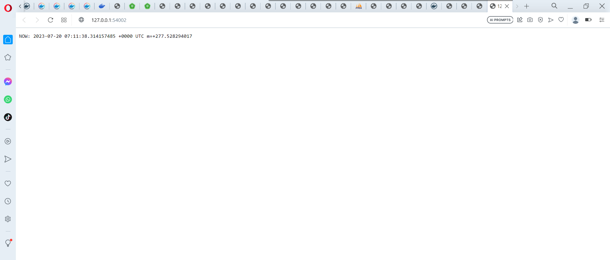

## Enable addons

List the currently supported addons:

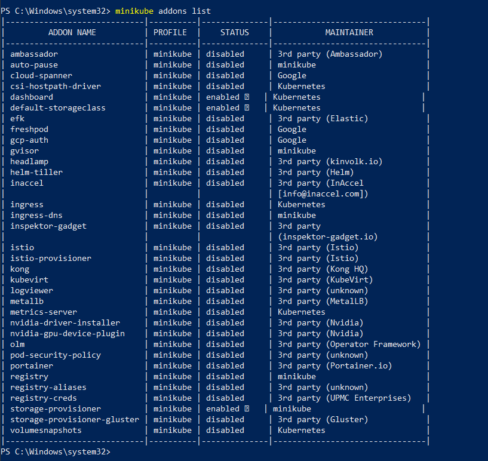

Enable an addon, for example, metrics-server:

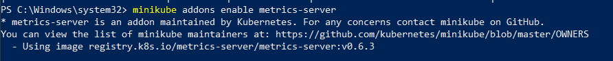

View the Pod and Service you created by installing that addon:

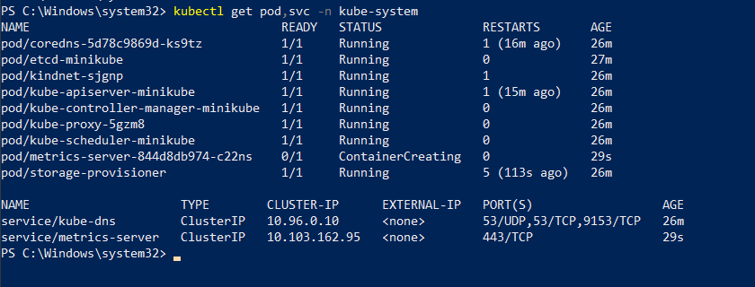

Disable metrics-server:

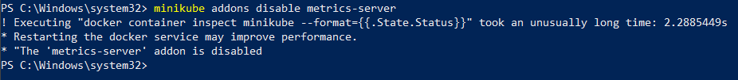

## Clean up

Now you can clean up the resources you created in your cluster:

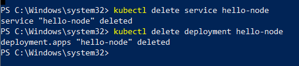

Stop the Minikube cluster

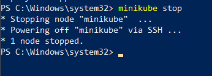

